# Events Management Application - Overview

> **Copyright © 2024 TechJamLabs**  
> Website: [www.techjamlabs.com](https://www.techjamlabs.com)  
> Phone: +234 201 330 9089 | +1 206 710 0170  
> **Authors:** Ben Adenle, Odinaka Solomon, Dare Oloruntoba

---

## 🎯 **Application Overview**

The **Events Management Application** provides comprehensive event planning, registration, and management capabilities for ACPN Lagos, enabling professional development events, conferences, workshops, and community gatherings.

### **Primary Functions**

1. **Event Creation & Setup**
   - Event planning and configuration
   - Venue management and booking
   - Session scheduling and management
   - Speaker and facilitator coordination

2. **Registration Management**
   - Online event registration
   - Multi-tier pricing strategies
   - Capacity management and waitlists
   - Group registration handling

3. **Payment Processing**
   - Secure payment collection
   - Multiple payment method support
   - Refund and cancellation handling
   - Financial reporting and reconciliation

4. **Attendance Tracking**
   - Check-in and check-out systems
   - QR code and digital ticket support
   - Real-time attendance monitoring
   - Attendance certificate generation

5. **CPD Event Integration**
   - CPD credit calculation and assignment
   - Professional development tracking
   - Certificate generation for CPD events
   - PCN compliance reporting

6. **Event Analytics**
   - Registration and attendance analytics
   - Revenue and financial reporting
   - Attendee satisfaction surveys
   - Event performance metrics

---

## 🏗️ **Architecture Overview**

### **System Architecture**

```mermaid
graph TB
    subgraph "Events Management Application"
        EVENT_CREATE[Event Creation Service]
        REGISTRATION[Registration Management]
        PAYMENT_PROC[Payment Processing]
        ATTENDANCE[Attendance Tracking]
        CPD_INT[CPD Integration Service]
        ANALYTICS[Event Analytics]
    end
    
    subgraph "External Integrations"
        PAYMENT_GW[Payment Gateways]
        EMAIL_SVC[Email Services]
        SMS_SVC[SMS Services]
        QR_GEN[QR Code Generator]
        PCN_API[PCN Database]
    end
    
    subgraph "Data Layer"
        EVENT_DB[(Events Database)]
        REGISTRATION_DB[(Registration Database)]
        PAYMENT_DB[(Payment Database)]
        ATTENDANCE_DB[(Attendance Database)]
    end
    
    EVENT_CREATE --> EVENT_DB
    REGISTRATION --> REGISTRATION_DB
    REGISTRATION --> EMAIL_SVC
    REGISTRATION --> SMS_SVC
    
    PAYMENT_PROC --> PAYMENT_GW
    PAYMENT_PROC --> PAYMENT_DB
    
    ATTENDANCE --> QR_GEN
    ATTENDANCE --> ATTENDANCE_DB
    
    CPD_INT --> PCN_API
    CPD_INT --> EVENT_DB
    CPD_INT --> ATTENDANCE_DB
    
    ANALYTICS --> EVENT_DB
    ANALYTICS --> REGISTRATION_DB
    ANALYTICS --> PAYMENT_DB
    ANALYTICS --> ATTENDANCE_DB
```

This Events Management Application streamlines the entire event lifecycle from planning to post-event analysis and CPD credit allocation. 