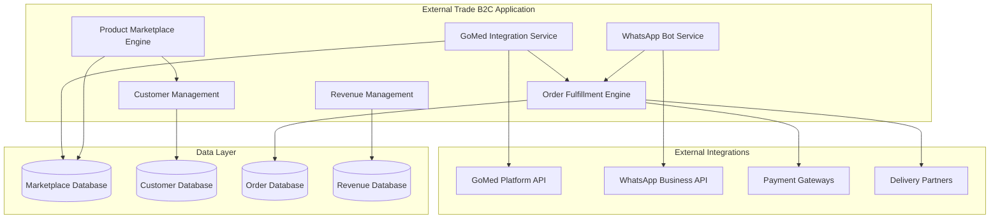

# External Trade Application (B2C) - Overview

> **Copyright © 2024 TechJamLabs**  
> Website: [www.techjamlabs.com](https://www.techjamlabs.com)  
> Phone: +234 201 330 9089 | +1 206 710 0170  
> **Authors:** Ben Adenle, Odinaka Solomon, Dare Oloruntoba

---

## 🎯 **Application Overview**

The **External Trade Application (B2C)** integrates with external platforms like GoMed to enable business-to-consumer pharmaceutical sales, marketplace operations, and customer-facing commerce through automated systems.

### **Primary Functions**

1. **GoMed Integration**
   - Seamless platform connectivity
   - Real-time inventory synchronization
   - Order processing automation
   - Revenue sharing management

2. **Product Marketplace**
   - Product catalog exposure
   - Competitive pricing management
   - Product availability broadcasting
   - Customer review management

3. **WhatsApp Bot Integration**
   - Automated customer interactions
   - Product availability queries
   - Order status updates
   - Customer support automation

4. **Order Fulfillment**
   - Multi-channel order processing
   - Inventory allocation
   - Delivery coordination
   - Customer communication

5. **Customer Management**
   - Customer profile management
   - Order history tracking
   - Preference management
   - Loyalty program integration

6. **Revenue Management**
   - Commission tracking
   - Revenue reconciliation
   - Financial reporting
   - Performance analytics

---

## 🏗️ **Architecture Overview**

### **System Architecture**

This External Trade B2C Application enables seamless integration with external platforms for consumer-facing pharmaceutical sales. 