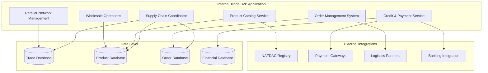

# Internal Trade Application (B2B) - Overview

> **Copyright © 2024 TechJamLabs**  
> Website: [www.techjamlabs.com](https://www.techjamlabs.com)  
> Phone: +234 201 330 9089 | +1 206 710 0170  
> **Authors:** Ben Adenle, Odinaka Solomon, Dare Oloruntoba

---

## 🎯 **Application Overview**

The **Internal Trade Application (B2B)** facilitates wholesale-retailer trade relationships within the ACPN network, enabling efficient B2B commerce, supply chain management, and business-to-business transactions between pharmacies.

### **Primary Functions**

1. **Wholesale Operations**
   - Wholesale product catalog management
   - Bulk pricing and tier management
   - Minimum order quantity enforcement
   - Volume discount calculations

2. **Retailer Network**
   - Retailer registration and verification
   - Credit assessment and limits
   - Relationship management
   - Performance tracking

3. **Product Catalog Management**
   - NAFDAC-compliant product listings
   - Product specifications and documentation
   - Pricing strategy management
   - Inventory synchronization

4. **Order Management System**
   - Order creation and processing
   - Approval workflows
   - Order tracking and status updates
   - Delivery coordination

5. **Credit & Payment Terms**
   - Credit line management
   - Payment terms negotiation
   - Invoice generation and tracking
   - Payment processing and reconciliation

6. **Supply Chain Coordination**
   - Multi-tier distribution networks
   - Logistics partner integration
   - Inventory optimization
   - Demand forecasting

---

## 🏗️ **Architecture Overview**

### **System Architecture**

This Internal Trade B2B Application streamlines wholesale-retailer relationships and B2B commerce within the pharmaceutical network. 