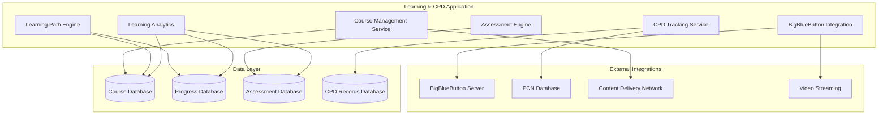

# Learning & CPD Application - Overview

> **Copyright © 2024 TechJamLabs**  
> Website: [www.techjamlabs.com](https://www.techjamlabs.com)  
> Phone: +234 201 330 9089 | +1 206 710 0170  
> **Authors:** Ben Adenle, Odinaka Solomon, Dare Oloruntoba

---

## 🎯 **Application Overview**

The **Learning & CPD (Continuing Professional Development) Application** provides comprehensive training and professional development opportunities for pharmacists, enabling them to maintain their professional credentials and advance their careers.

### **Primary Functions**

1. **Course Management**
   - Course creation and curation
   - Content delivery and streaming
   - Multi-format content support
   - Course catalog organization

2. **Learning Paths**
   - Structured learning journeys
   - Prerequisite management
   - Progress tracking
   - Competency mapping

3. **Assessment & Certification**
   - Online assessments and quizzes
   - Practical evaluations
   - Certificate generation
   - Credential verification

4. **BigBlueButton Integration**
   - Live virtual classrooms
   - Interactive webinars
   - Recording and playback
   - Real-time collaboration

5. **CPD Credit Tracking**
   - Automated credit calculation
   - PCN requirement compliance
   - Credit history management
   - Annual requirement tracking

6. **Learning Analytics**
   - Student progress monitoring
   - Course effectiveness analysis
   - Engagement metrics
   - Performance reporting

---

## 🏗️ **Architecture Overview**

### **System Architecture**

This Learning & CPD Application ensures continuous professional development and regulatory compliance for pharmacists. 