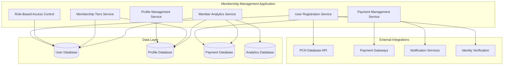
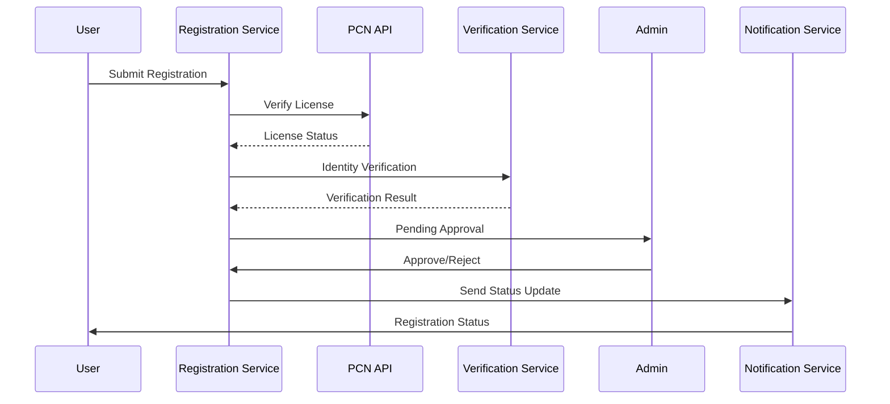
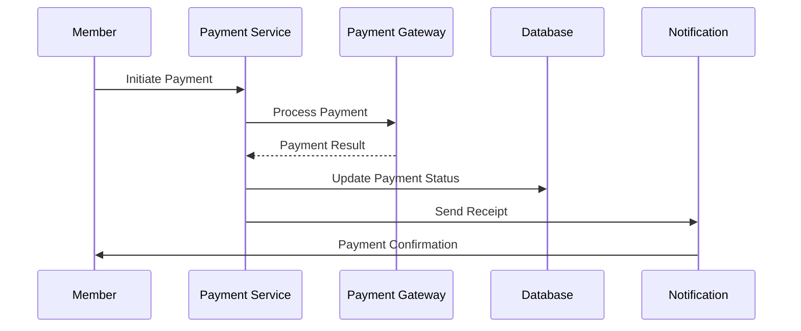

# Membership Management Application - Overview

> **Copyright © 2024 TechJamLabs**  
> Website: [www.techjamlabs.com](https://www.techjamlabs.com)  
> Phone: +234 201 330 9089 | +1 206 710 0170  
> **Authors:** Ben Adenle, Odinaka Solomon, Dare Oloruntoba

---

## 🎯 **Application Overview**

The **Membership Management Application** is the foundational component of the ACPN Lagos Portal, responsible for managing all aspects of member registration, verification, profile management, and membership lifecycle operations.

### **Primary Functions**

1. **User Registration & Verification**
   - Professional pharmacist registration
   - PCN license verification
   - Identity document validation
   - Multi-tier approval process

2. **Profile Management**
   - Comprehensive member profiles
   - Professional credentials tracking
   - Contact information management
   - Emergency contact details

3. **Role-Based Access Control**
   - Hierarchical permission system
   - Role assignment and management
   - Access level enforcement
   - Security policy implementation

4. **Membership Tiers & Benefits**
   - Multiple membership categories
   - Tier-based benefits and privileges
   - Membership upgrade/downgrade
   - Benefits tracking and delivery

5. **Dues & Payment Management**
   - Annual dues calculation
   - Payment processing and tracking
   - Payment method management
   - Receipt generation and delivery

6. **Member Analytics**
   - Membership statistics and trends
   - Engagement analytics
   - Payment analytics
   - Member satisfaction metrics

---

## 🏗️ **Architecture Overview**

### **System Architecture**

This Membership Management Application serves as the backbone of the ACPN Lagos Portal.

---

## 👥 **User Types & Roles**

### **Member Categories**
- **Full Members**: Licensed pharmacists with full benefits
- **Associate Members**: Non-pharmacist healthcare professionals
- **Student Members**: Pharmacy students and interns
- **Honorary Members**: Distinguished industry professionals
- **Corporate Members**: Pharmaceutical companies and organizations

### **System Roles**
- **Super Admin**: Full system access and control
- **Membership Admin**: Member management and verification
- **Financial Admin**: Payment and dues management
- **Analytics Admin**: Reporting and analytics access
- **Member**: Standard member access and privileges

---

## 🔄 **Core Workflows**

### **Member Registration Flow**

### **Payment Processing Flow**

---

## 📊 **Key Features**

### **Registration & Verification**
- **Multi-step Registration**: Progressive form completion
- **Document Upload**: Secure document handling
- **PCN Integration**: Real-time license verification
- **Identity Verification**: KYC compliance
- **Approval Workflow**: Multi-tier approval process

### **Profile Management**
- **Comprehensive Profiles**: Professional and personal information
- **Document Management**: Certificate and license storage
- **Photo Management**: Profile picture handling
- **Contact Updates**: Real-time contact information
- **Privacy Controls**: Member visibility settings

### **Access Control**
- **Role Assignment**: Dynamic role management
- **Permission Matrix**: Granular access control
- **Session Management**: Secure session handling
- **Audit Logging**: Complete access audit trail
- **Security Policies**: Configurable security rules

### **Payment System**
- **Multiple Payment Methods**: Cards, bank transfers, mobile money
- **Automated Billing**: Annual dues automation
- **Payment Tracking**: Complete payment history
- **Receipt Management**: Automated receipt generation
- **Refund Processing**: Streamlined refund handling

---

## 📈 **Analytics & Reporting**

### **Member Analytics**
- Registration trends and patterns
- Membership growth metrics
- Demographic analysis
- Engagement statistics
- Retention rates

### **Payment Analytics**
- Payment success rates
- Revenue tracking
- Payment method preferences
- Outstanding dues analysis
- Financial forecasting

### **System Analytics**
- User activity monitoring
- Feature usage statistics
- Performance metrics
- Error tracking and analysis
- Security incident reporting

---

## 🔒 **Security & Compliance**

### **Data Protection**
- **Encryption**: End-to-end data encryption
- **Access Control**: Strict access permissions
- **Audit Trails**: Complete activity logging
- **Data Backup**: Regular automated backups
- **GDPR Compliance**: Data protection compliance

### **Professional Standards**
- **PCN Compliance**: Nigerian pharmacy regulations
- **KYC Requirements**: Know Your Customer protocols
- **Professional Ethics**: Code of conduct enforcement
- **Continuing Education**: CPD requirement tracking
- **License Monitoring**: Expiration and renewal tracking

---

## 🚀 **Performance Metrics**

### **Key Performance Indicators**
- **Registration Completion Rate**: >90%
- **Verification Processing Time**: <24 hours
- **Payment Success Rate**: >95%
- **Member Satisfaction Score**: >4.5/5
- **System Uptime**: >99.9%
- **Response Time**: <2 seconds

### **Business Metrics**
- **Monthly New Registrations**: Growth tracking
- **Member Retention Rate**: Annual retention
- **Revenue per Member**: Financial performance
- **Support Ticket Resolution**: <4 hours
- **Member Engagement Score**: Activity tracking

---

## 🔗 **Integration Points**

### **Internal Integrations**
- **Pharmacy Stores Management**: Store ownership linking
- **Learning & CPD Application**: Training record integration
- **Events Management**: Event registration integration
- **Trade Applications**: Trading permission verification

### **External Integrations**
- **PCN Database**: License verification
- **Payment Gateways**: Financial transactions
- **Identity Verification**: KYC services
- **Communication Services**: Email, SMS, WhatsApp
- **Government APIs**: Regulatory compliance

---

This Membership Management Application serves as the backbone of the ACPN Lagos Portal, ensuring secure, compliant, and efficient management of all member-related operations while providing a seamless user experience for both members and administrators. 