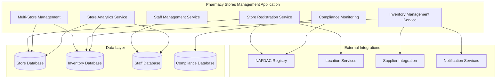

# Pharmacy Stores Management Application - Overview

> **Copyright © 2024 TechJamLabs**  
> Website: [www.techjamlabs.com](https://www.techjamlabs.com)  
> Phone: +234 201 330 9089 | +1 206 710 0170  
> **Authors:** Ben Adenle, Odinaka Solomon, Dare Oloruntoba

---

## 🎯 **Application Overview**

The **Pharmacy Stores Management Application** enables pharmacists to efficiently manage their pharmacy operations, including store registration, multi-store management, inventory tracking, staff management, and compliance monitoring.

### **Primary Functions**

1. **Store Registration & Setup**
   - Pharmacy license verification
   - Store location and details registration
   - Operating hours and contact information
   - Regulatory compliance setup

2. **Multi-Store Operations**
   - Multiple store ownership management
   - Centralized store administration
   - Cross-store inventory visibility
   - Consolidated reporting and analytics

3. **Inventory Management**
   - Product catalog management
   - Stock level tracking
   - Expiry date monitoring
   - Automated reorder alerts

4. **Staff Management**
   - Employee registration and verification
   - Role assignment and permissions
   - Work schedule management
   - Performance tracking

5. **Compliance & Licensing**
   - NAFDAC registration tracking
   - License renewal monitoring
   - Regulatory requirement compliance
   - Inspection and audit support

6. **Store Analytics**
   - Sales performance metrics
   - Inventory turnover analysis
   - Staff productivity reports
   - Customer satisfaction tracking

---

## 🏗️ **Architecture Overview**

### **System Architecture**

This Pharmacy Stores Management Application provides comprehensive tools for efficient pharmacy operations management. 