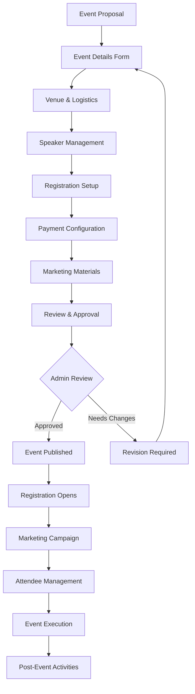

# Events Management System

## 🎯 **Overview**

The ACPN Lagos Portal Events Management System is a comprehensive platform designed to facilitate pharmaceutical events, continuing professional development (CPD) programs, conferences, workshops, and professional networking activities. This system integrates with the CPD tracking system, payment processing, and communication platforms to deliver a seamless event experience.

---

## 📋 **Event Lifecycle Management**

### 1. Event Planning & Creation

#### 1.1 Event Types Supported
- **CPD Events**: Continuing professional development activities
  - Lectures and seminars
  - Hands-on workshops
  - Clinical skills training
  - Regulatory updates sessions

- **Professional Events**: Industry networking and development
  - Annual conferences
  - Regional meetings
  - Awards ceremonies
  - Product launches

- **Community Events**: Public health initiatives
  - Health outreach programs
  - Free screening events
  - Public education campaigns
  - Medication awareness drives

- **Educational Events**: Learning and development
  - Research symposiums
  - Case study presentations
  - Journal clubs
  - Mentorship programs

#### 1.2 Event Creation Workflow



#### 1.3 Event Configuration Parameters

```typescript
interface EventConfiguration {
  basic: {
    title: string
    description: string
    category: EventCategory
    type: EventType
    tags: string[]
  }
  
  scheduling: {
    startDate: Date
    endDate: Date
    timezone: string
    duration: number // minutes
    sessions: EventSession[]
  }
  
  location: {
    type: 'physical' | 'virtual' | 'hybrid'
    venue?: VenueDetails
    virtualPlatform?: VirtualPlatformConfig
    address?: Address
    capacity: number
  }
  
  registration: {
    required: boolean
    openDate: Date
    closeDate: Date
    waitlistEnabled: boolean
    confirmationRequired: boolean
    cancellationPolicy: CancellationPolicy
  }
  
  pricing: {
    type: 'free' | 'paid' | 'tiered'
    currency: 'NGN'
    tiers?: PricingTier[]
    discounts?: DiscountRule[]
    refundPolicy: RefundPolicy
  }
  
  cpd: {
    eligible: boolean
    credits: number
    accreditingBody: string
    certificateTemplate: string
    attendanceRequirement: number // percentage
  }
  
  content: {
    agenda: EventAgenda[]
    speakers: Speaker[]
    materials: EventMaterial[]
    requirements: string[]
  }
  
  marketing: {
    bannerImage: string
    gallery: string[]
    promotionalContent: MarketingContent
    socialMediaConfig: SocialMediaConfig
  }
}
```

### 2. Registration Management

#### 2.1 Registration Types & Tiers

```typescript
interface RegistrationTier {
  id: string
  name: string
  description: string
  price: number
  capacity?: number
  features: string[]
  conditions: {
    membershipRequired?: boolean
    profession?: UserRole[]
    experienceLevel?: 'entry' | 'intermediate' | 'advanced'
    prerequisites?: string[]
  }
  
  earlyBird?: {
    price: number
    deadline: Date
  }
  
  group?: {
    minimumSize: number
    discountPercentage: number
  }
}

interface RegistrationForm {
  personalInfo: {
    firstName: string
    lastName: string
    email: string
    phone: string
    profession: string
    pcnNumber?: string
    workPlace: string
  }
  
  preferences: {
    dietaryRequirements: string[]
    accessibility: string[]
    accommodation: boolean
    networking: boolean
  }
  
  emergency: {
    contactName: string
    contactPhone: string
    relationship: string
    medicalConditions?: string
  }
  
  agreement: {
    termsAccepted: boolean
    marketingConsent: boolean
    dataProcessingConsent: boolean
  }
}
```

### 3. CPD Integration & Certification

#### 3.1 CPD Credit Calculation

```typescript
interface CPDCreditSystem {
  calculation: {
    formula: 'duration_based' | 'content_based' | 'assessment_based'
    minimumAttendance: number // percentage
    assessmentRequired: boolean
    practicalComponent: boolean
  }
  
  validation: {
    realTimeTracking: boolean
    randomChecks: boolean
    biometricVerification: boolean
    peerVerification: boolean
  }
  
  certification: {
    automaticGeneration: boolean
    template: CertificateTemplate
    verificationMethod: 'qr_code' | 'blockchain' | 'digital_signature'
    distributionMethod: 'email' | 'portal' | 'both'
  }
  
  reporting: {
    pcnIntegration: boolean
    transcriptUpdate: boolean
    complianceReport: boolean
    auditTrail: boolean
  }
}
```

### 4. Event Analytics & Reporting

#### 4.1 Event Performance Metrics

```typescript
interface EventAnalytics {
  registration: {
    conversionRate: number
    dropOffPoints: DropOffAnalysis[]
    channelEffectiveness: ChannelMetrics[]
    demographicBreakdown: DemographicAnalysis
  }
  
  engagement: {
    attendanceRate: number
    sessionPopularity: SessionMetrics[]
    interactionMetrics: InteractionAnalysis
    contentRating: ContentRating[]
  }
  
  satisfaction: {
    overallRating: number
    netPromoterScore: number
    satisfactionByCategory: CategoryRating[]
    testimonials: Testimonial[]
  }
  
  business: {
    revenue: RevenueAnalysis
    costAnalysis: CostBreakdown
    roi: number
    profitability: ProfitabilityMetrics
  }
  
  impact: {
    cpdCreditsIssued: number
    learningOutcomes: LearningMetrics[]
    behaviorChange: BehaviorMetrics[]
    networkingValue: NetworkingAnalysis
  }
}
```

## 🎯 **Success Metrics & KPIs**

### Event Success Indicators
- **Registration Conversion Rate**: >15%
- **Attendance Rate**: >85%
- **Satisfaction Score**: >4.5/5
- **CPD Completion Rate**: >95%
- **Revenue Target Achievement**: 100%
- **Engagement Level**: >70% active participation

### Quality Assurance
- **Technical Issues**: <5% of event duration
- **Registration Problems**: <2% of registrations
- **Payment Failures**: <1% of transactions
- **Certificate Delivery**: <24 hours post-event
- **Feedback Response Rate**: >60%

---

This comprehensive events management system ensures that ACPN Lagos can deliver high-quality, engaging, and valuable professional development experiences while maintaining efficient operations and measurable outcomes. 