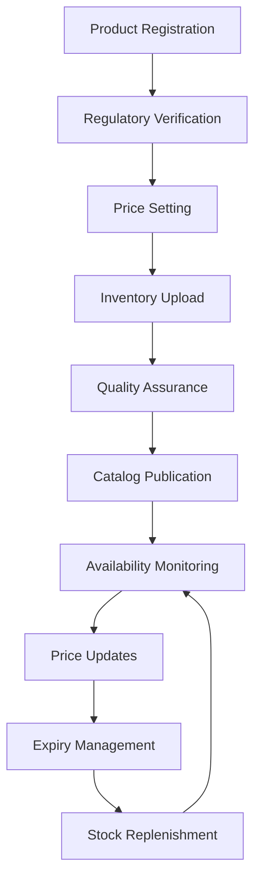
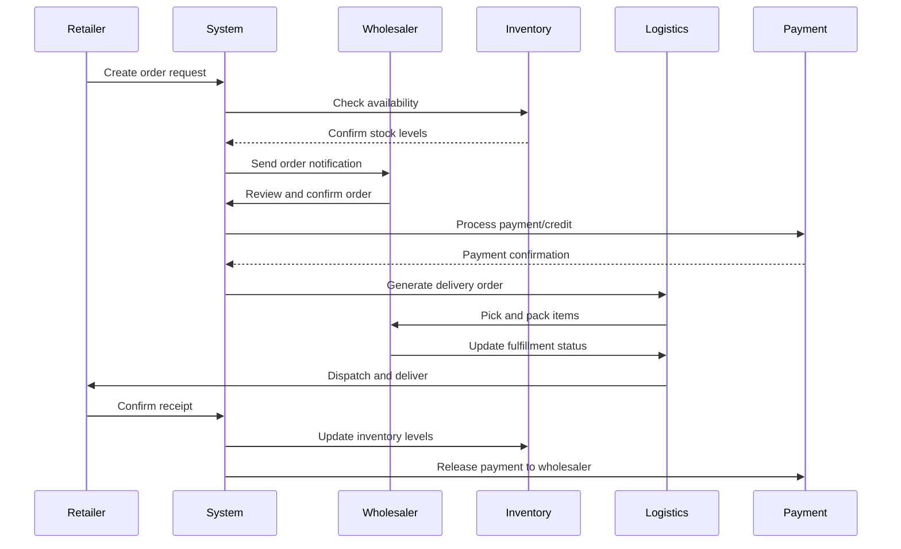
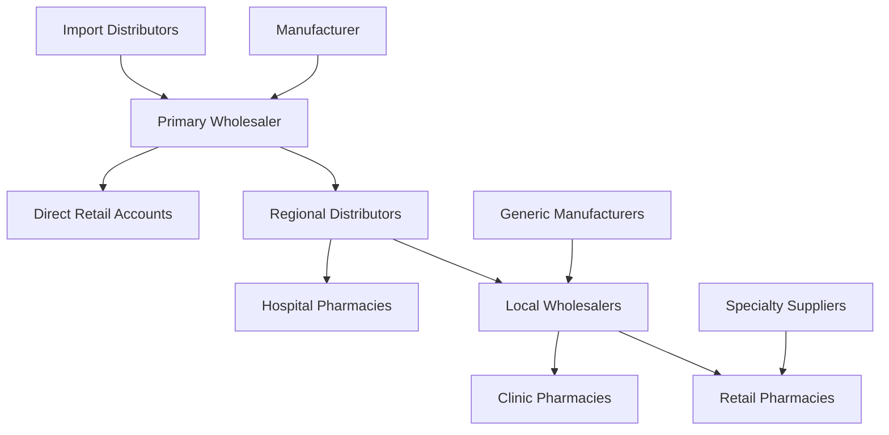
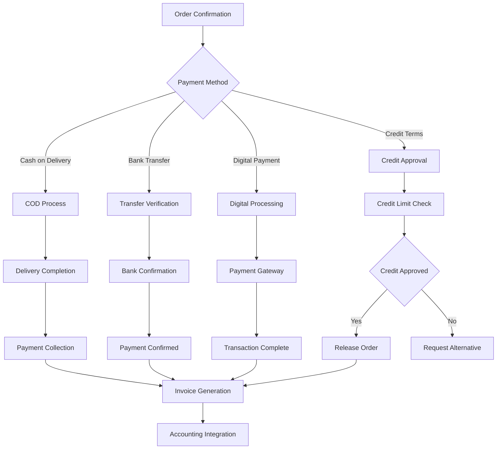

# Wholesale-Retailer Trade Management

## 🎯 **Overview**

The ACPN Lagos Portal Wholesale-Retailer Trade System facilitates efficient B2B pharmaceutical trading between wholesalers, distributors, and retail pharmacies. This comprehensive platform streamlines inventory management, pricing negotiations, order processing, and supply chain coordination while ensuring regulatory compliance and quality assurance.

---

## 🏗️ **Trade Ecosystem Architecture**

### 1. Participant Categories

#### 1.1 Wholesaler Types
- **Licensed Pharmaceutical Wholesalers**: Primary distributors with valid PCN wholesale licenses
- **Authorized Distributors**: Manufacturer-appointed distribution partners
- **Regional Distributors**: Geographic territory-specific suppliers
- **Specialty Wholesalers**: Focused on specific therapeutic categories
- **Generic Suppliers**: Specialists in generic pharmaceutical products

#### 1.2 Retailer Categories
- **Independent Pharmacies**: Single-location retail operations
- **Pharmacy Chains**: Multi-location retail networks
- **Hospital Pharmacies**: Institutional pharmaceutical departments
- **Clinic Pharmacies**: Healthcare facility dispensing units
- **Specialty Pharmacies**: Focused therapeutic area retailers

#### 1.3 Trade Relationship Matrix

```typescript
interface TradingRelationship {
  wholesaler: {
    id: string
    businessName: string
    licenseNumber: string
    category: WholesalerCategory
    creditRating: CreditRating
    paymentTerms: PaymentTerms[]
    deliveryCapability: DeliveryCapability
  }
  
  retailer: {
    id: string
    pharmacyName: string
    licenseNumber: string
    category: RetailerCategory
    creditLimit: number
    paymentHistory: PaymentHistory
    orderVolume: OrderVolumeMetrics
  }
  
  relationship: {
    establishedDate: Date
    trustScore: number
    tradingVolume: number
    preferredSupplier: boolean
    exclusiveProducts: string[]
    contractTerms: ContractTerms
  }
}
```

### 2. Product Catalog Management

#### 2.1 Wholesaler Product Listing



#### 2.2 Product Information Structure

```typescript
interface WholesaleProduct {
  identification: {
    sku: string
    nafdacNumber: string
    brandName: string
    genericName: string
    manufacturer: string
    importerDistributor?: string
  }
  
  specifications: {
    strength: string
    dosageForm: DosageForm
    packSize: string
    activeIngredients: ActiveIngredient[]
    therapeuticClass: string
    storageConditions: StorageCondition[]
  }
  
  regulatory: {
    nafdacRegistration: NAFDACRegistration
    scheduleClass: ScheduleClass
    prescriptionRequired: boolean
    importPermit?: string
    gmpCertificate: boolean
  }
  
  commercial: {
    wholesalePrice: number
    suggestedRetailPrice: number
    minimumOrderQuantity: number
    packagingUnit: PackagingUnit
    bulkDiscounts: BulkDiscount[]
    paymentTerms: PaymentTerms
  }
  
  logistics: {
    weight: number
    dimensions: Dimensions
    temperatureRequirement: TemperatureRange
    shelfLife: number
    countryOfOrigin: string
    leadTime: number
  }
  
  inventory: {
    stockLevel: number
    availableQuantity: number
    reservedQuantity: number
    reorderLevel: number
    batchInformation: BatchInfo[]
    expiryDates: ExpiryInfo[]
  }
}
```

### 3. Order Management System

#### 3.1 Order Lifecycle



#### 3.2 Order Types & Processing

```typescript
interface OrderTypes {
  standard: {
    processingTime: '24-48 hours'
    minimumValue: number
    paymentTerms: 'Net 30' | 'Net 60' | 'COD'
    deliveryMethod: 'Standard' | 'Express'
  }
  
  urgent: {
    processingTime: '2-6 hours'
    urgencyFee: number
    paymentTerms: 'COD' | 'Prepaid'
    deliveryMethod: 'Express' | 'Same Day'
  }
  
  bulk: {
    minimumQuantity: number
    volumeDiscount: number
    processingTime: '48-72 hours'
    paymentTerms: 'Net 60' | 'Letter of Credit'
    deliveryMethod: 'Freight' | 'Direct'
  }
  
  subscription: {
    frequency: 'Weekly' | 'Monthly' | 'Quarterly'
    autoReplenishment: boolean
    discountRate: number
    paymentTerms: 'Auto-debit' | 'Net 30'
  }
}
```

### 4. Supply Chain Coordination

#### 4.1 Multi-Tier Distribution Network



#### 4.2 Supply Chain Visibility

```typescript
interface SupplyChainVisibility {
  traceability: {
    batchTracking: boolean
    manufacturerToRetail: boolean
    temperatureMonitoring: boolean
    handlingHistory: HandlingRecord[]
  }
  
  realTimeUpdates: {
    inventoryLevels: boolean
    shipmentStatus: boolean
    qualityAlerts: boolean
    priceChanges: boolean
  }
  
  predictiveAnalytics: {
    demandForecasting: DemandForecast[]
    stockoutPrediction: StockoutAlert[]
    priceVolatility: PriceVolatilityMetrics
    seasonalTrends: SeasonalAnalysis[]
  }
  
  collaboration: {
    sharedInventory: boolean
    crossDocking: boolean
    dropShipping: boolean
    consolidatedShipments: boolean
  }
}
```

### 5. Financial Management & Credit System

#### 5.1 Credit Assessment Framework

```typescript
interface CreditAssessment {
  evaluation: {
    businessHistory: number // years
    financialStatements: FinancialStatement[]
    tradingVolume: TradingVolumeMetrics
    paymentHistory: PaymentHistoryAnalysis
    references: TradeReference[]
  }
  
  creditScoring: {
    model: CreditScoringModel
    factors: {
      paymentTimeliness: number // weight
      orderVolume: number       // weight
      businessStability: number // weight
      financialHealth: number   // weight
      industryRisk: number      // weight
    }
    scoreRange: { min: number, max: number }
  }
  
  creditLimits: {
    calculation: CreditLimitCalculation
    tiers: CreditTier[]
    adjustment: CreditAdjustmentRules
    monitoring: CreditMonitoringRules
  }
}
```

#### 5.2 Payment Processing & Terms



### 6. Regulatory Compliance & Documentation

#### 6.1 Regulatory Framework

```typescript
interface RegulatoryCompliance {
  nafdac: {
    productRegistration: NAFDACRegistrationRequirement[]
    facilityLicensing: FacilityLicenseRequirement[]
    importPermits: ImportPermitRequirement[]
    advertisingApproval: AdvertisingRequirement[]
  }
  
  pcn: {
    wholesaleLicense: WholesaleLicenseRequirement[]
    pharmacistLicense: PharmacistLicenseRequirement[]
    facilityInspection: InspectionRequirement[]
    continuingEducation: CERequirement[]
  }
  
  customs: {
    importDocumentation: ImportDocumentRequirement[]
    dutyCalculation: DutyCalculationRules[]
    clearanceProcess: ClearanceProcessRequirement[]
    bondedWarehouse: BondedWarehouseRequirement[]
  }
  
  taxation: {
    vatRequirements: VATRequirement[]
    withholdingTax: WithholdingTaxRules[]
    stateHarmonizedBilling: HarmonizedBillingRequirement[]
    companyIncomeTax: CITRequirement[]
  }
}
```

### 7. Market Intelligence & Analytics

#### 7.1 Market Data Collection

```typescript
interface MarketIntelligence {
  priceMonitoring: {
    competitorPricing: CompetitorPriceData[]
    marketTrends: PriceTrendAnalysis[]
    priceElasticity: ElasticityMetrics[]
    volatilityIndicators: VolatilityMetrics[]
  }
  
  demandAnalysis: {
    seasonalPatterns: SeasonalDemandPattern[]
    therapeuticTrends: TherapeuticTrendAnalysis[]
    geographicVariation: GeographicDemandData[]
    emergingNeeds: EmergingDemandSignals[]
  }
  
  supplyMonitoring: {
    supplierPerformance: SupplierMetrics[]
    inventoryLevels: InventoryTrendData[]
    productAvailability: AvailabilityMetrics[]
    qualityIndicators: QualityTrendData[]
  }
  
  competitiveAnalysis: {
    marketShare: MarketShareData[]
    pricingStrategies: PricingStrategyAnalysis[]
    serviceComparison: ServiceComparisonData[]
    customerSatisfaction: SatisfactionMetrics[]
  }
}
```

### 8. Performance Metrics & KPIs

#### 8.1 Trade Performance Indicators

```typescript
interface TradeKPIs {
  operational: {
    orderFulfillmentRate: number      // Target: >95%
    averageOrderProcessingTime: number // Target: <24 hours
    inventoryTurnover: number         // Target: >6x annually
    stockoutRate: number              // Target: <2%
  }
  
  financial: {
    grossMargin: number               // Target: 15-25%
    daysPayableOutstanding: number    // Target: <45 days
    creditLossRate: number            // Target: <0.5%
    revenueGrowth: number             // Target: >20% annually
  }
  
  quality: {
    productComplaintRate: number      // Target: <0.1%
    deliveryAccuracy: number          // Target: >99%
    temperatureExcursions: number     // Target: <0.5%
    regulatoryCompliance: number      // Target: 100%
  }
  
  customer: {
    customerSatisfactionScore: number // Target: >4.5/5
    orderCompletionRate: number       // Target: >98%
    deliveryTimeliness: number        // Target: >95%
    returnRate: number                // Target: <1%
  }
}
```

## 🎯 **Strategic Benefits**

### Business Value Creation
- **Increased Efficiency**: Streamlined B2B trading processes
- **Cost Reduction**: Optimized inventory and logistics costs
- **Revenue Growth**: Expanded market reach and trading opportunities
- **Risk Mitigation**: Enhanced compliance and quality assurance
- **Data-Driven Decisions**: Advanced analytics and market intelligence

### Market Impact
- **Supply Chain Transparency**: End-to-end traceability
- **Price Discovery**: Efficient market-based pricing
- **Quality Assurance**: Standardized quality protocols
- **Regulatory Compliance**: Automated compliance management
- **Market Access**: Broader trading network participation

---

This comprehensive wholesale-retailer trade management system positions ACPN Lagos as a leader in pharmaceutical B2B commerce, delivering value to both wholesalers and retailers while ensuring the highest standards of quality, compliance, and efficiency. 