# Business Workflows & Process Architecture

## 🔄 **Comprehensive Business Process Overview**

### **Enterprise Business Process Architecture**

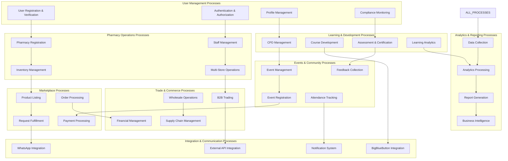

### **End-to-End Process Flow Architecture**

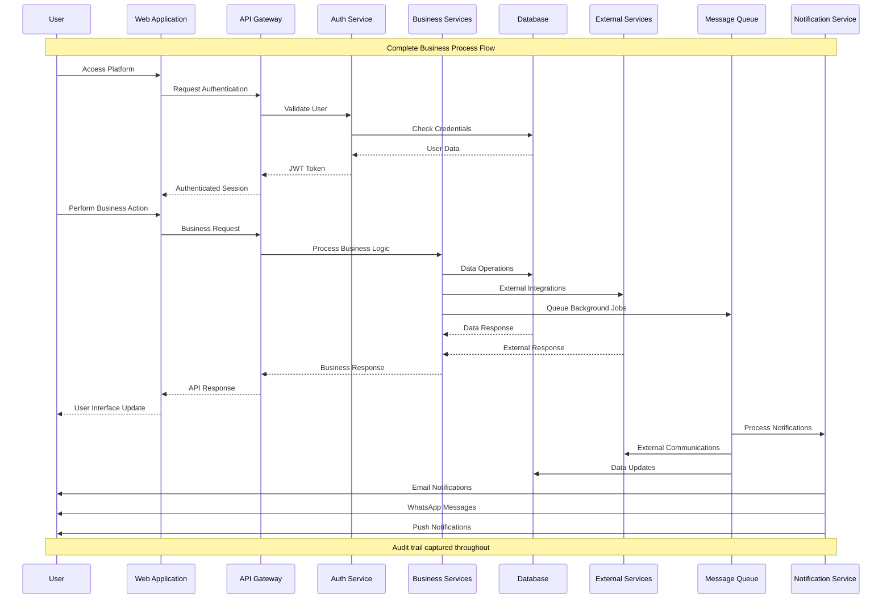

## 🔄 Core Business Processes

The ACPN Portal orchestrates several critical business workflows that support the pharmaceutical ecosystem in Lagos State. Each workflow is designed with automation, compliance, and user experience in mind.

## 1. 👨‍⚕️ User Registration & Verification Workflow

### 1.1 Pharmacist Registration Process

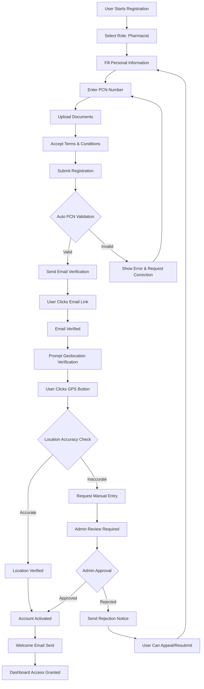

#### Business Rules
- **PCN Validation**: Real-time validation against PCN database
- **Document Requirements**: License copy, passport photo, work authorization
- **Geolocation Tolerance**: ±50 meters for GPS verification
- **Auto-Approval**: Pharmacists with verified PCN and accurate location
- **Manual Review**: Triggered by location discrepancies or document issues

#### Process Metrics
```typescript
interface RegistrationMetrics {
  averageCompletionTime: number      // Target: < 15 minutes
  autoApprovalRate: number           // Target: > 80%
  verificationSuccessRate: number    // Target: > 95%
  geolocationAccuracy: number        // Target: > 90%
  dropoffPoints: {
    personalInfo: number
    documentUpload: number
    emailVerification: number
    geolocation: number
  }
}
```

### 1.2 Doctor Registration Process

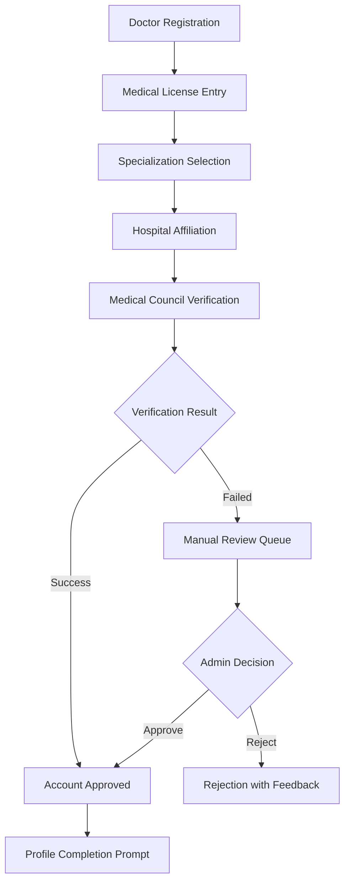

### 1.3 Hospital Registration Process

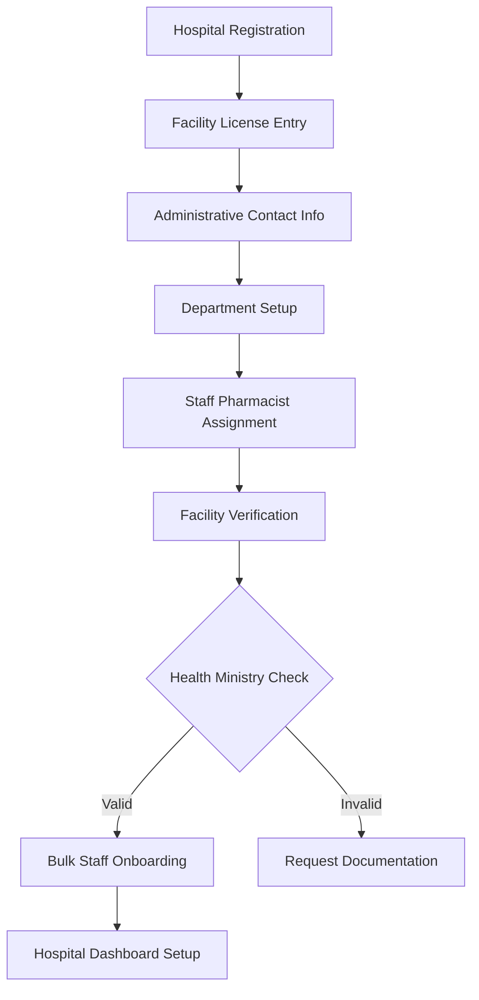

## 2. 🏥 Pharmacy Management Workflow

### 2.1 Pharmacy Setup & Verification

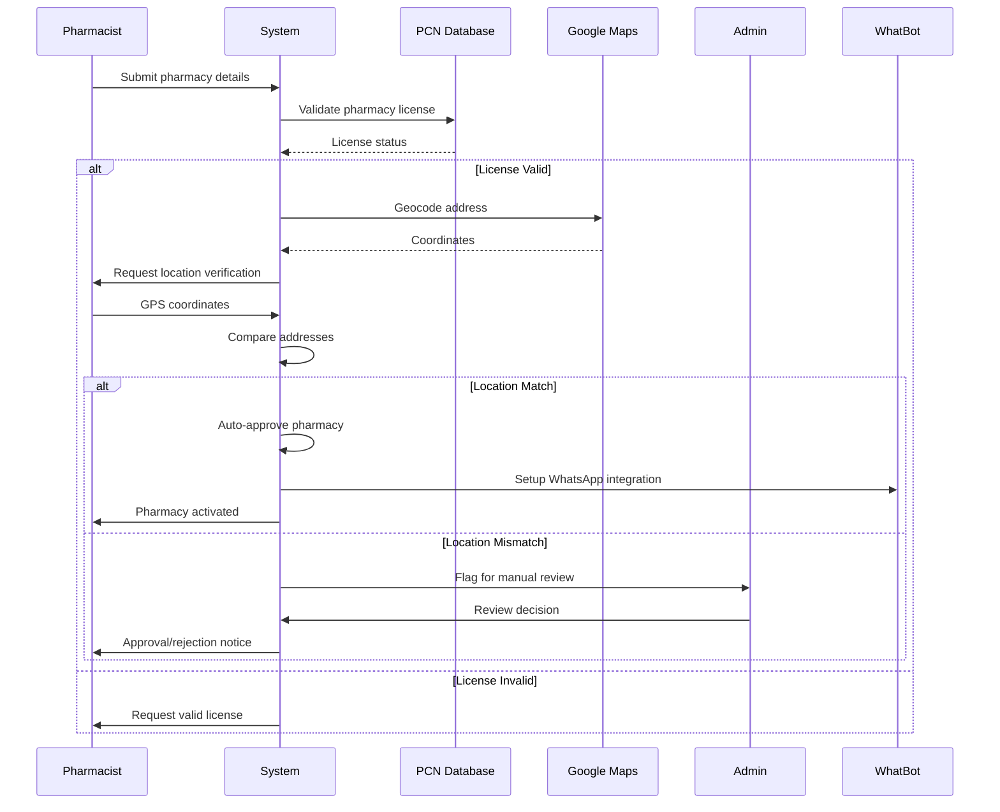

#### Key Verification Steps
1. **License Validation**: Cross-reference with PCN database
2. **Address Verification**: Compare registered vs. provided address
3. **GPS Verification**: Ensure physical presence at claimed location
4. **Operating Hours Setup**: Configure business hours and availability
5. **Staff Assignment**: Link pharmacists to pharmacy
6. **WhatsApp Integration**: Setup automated response system

### 2.2 Staff Management Workflow

```typescript
interface StaffOnboardingWorkflow {
  steps: [
    {
      id: 'staff_invitation'
      actor: 'pharmacy_owner'
      action: 'Send invitation email'
      data: {
        email: string
        role: StaffRole
        permissions: Permission[]
      }
    },
    {
      id: 'staff_registration'
      actor: 'invited_staff'
      action: 'Complete registration'
      validation: 'PCN verification for pharmacists'
    },
    {
      id: 'role_assignment'
      actor: 'system'
      action: 'Assign permissions based on role'
      automation: true
    },
    {
      id: 'training_assignment'
      actor: 'system'
      action: 'Assign mandatory training modules'
      conditional: 'role-based requirements'
    }
  ]
}
```

## 3. 🛒 Marketplace Workflow

### 3.1 Product Request & Fulfillment Process

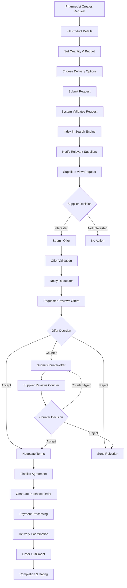

#### Business Logic
```typescript
interface MarketplaceLogic {
  requestMatching: {
    algorithm: 'proximity_price_rating'
    factors: {
      distance: { weight: 0.3, maxKm: 50 }
      price: { weight: 0.4, tolerance: 0.2 }
      rating: { weight: 0.2, minimum: 3.0 }
      responseTime: { weight: 0.1, prefer: 'fast' }
    }
  }
  
  offerExpiry: {
    default: '7 days'
    urgent: '24 hours'
    flexible: '14 days'
  }
  
  autoMatch: {
    criteria: {
      exactSku: true
      priceWithinBudget: true
      availableQuantity: '>=requested'
      ratingAbove: 4.0
    }
    action: 'auto_accept_if_single_match'
  }
}
```

### 3.2 Wholesale-to-Retail Process

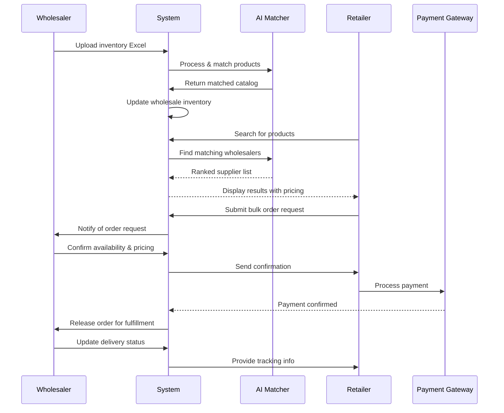

## 4. 🤖 WhatsApp Bot (WhatBot) Workflow

### 4.1 GoMed Integration Workflow

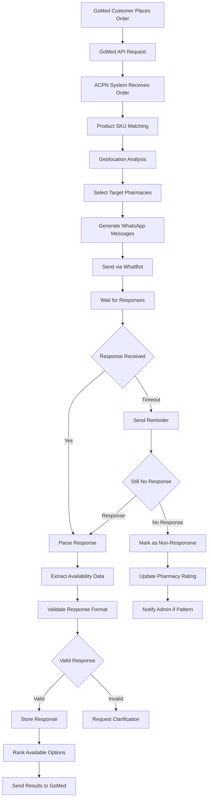

#### Response Parsing Algorithm
```typescript
interface ResponseParser {
  patterns: {
    availability: {
      positive: ['available', 'yes', 'have', 'stock', 'in stock', 'got it']
      negative: ['not available', 'no', 'out of stock', 'finished', 'none']
      partial: ['limited', 'few', 'small quantity', 'running low']
    }
    quantity: {
      patterns: [
        /(\d+)\s*(units?|pieces?|bottles?|boxes?|packs?)/i,
        /quantity[:\s]*(\d+)/i,
        /(\d+)\s*available/i
      ]
    }
    price: {
      patterns: [
        /₦\s*(\d+(?:,\d{3})*(?:\.\d{2})?)/,
        /naira\s*(\d+)/i,
        /(\d+)\s*naira/i,
        /price[:\s]*₦?\s*(\d+)/i
      ]
    }
  }
  
  confidence: {
    high: 0.9      // Clear keywords + numbers extracted
    medium: 0.7    // Keywords present, some ambiguity
    low: 0.5       // Partial match or unclear response
  }
  
  escalation: {
    lowConfidence: 'request_clarification'
    noKeywords: 'human_review'
    contradictory: 'manual_processing'
  }
}
```

### 4.2 Internal Marketplace Integration

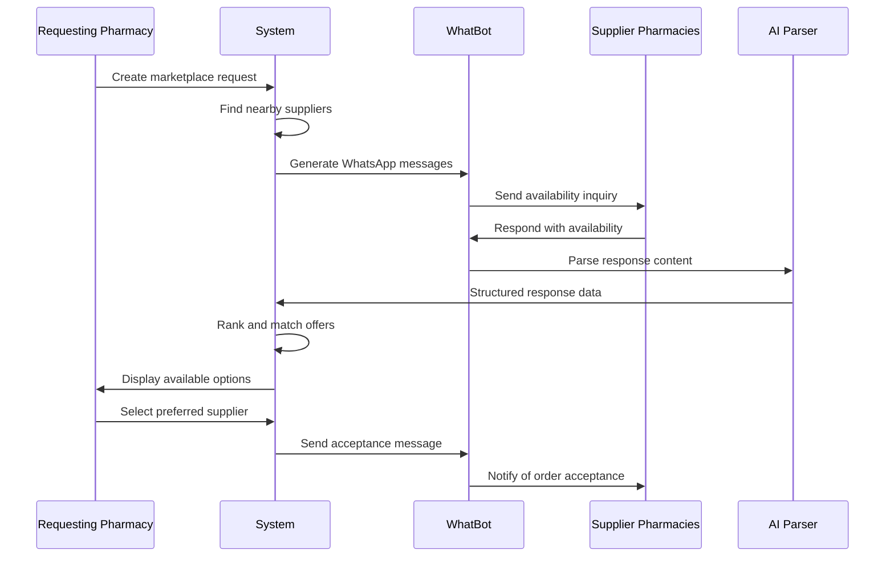

## 5. 🎓 Event Management Workflow

### 5.1 Event Creation & Management

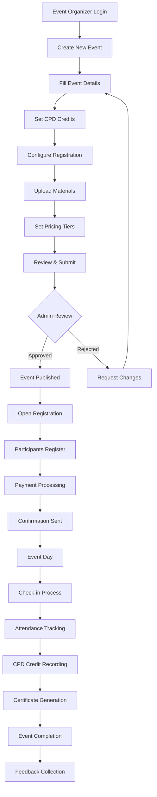

### 5.2 CPD Credit Tracking Workflow

```typescript
interface CPDTrackingWorkflow {
  eventRegistration: {
    validateEligibility: (userId: string) => boolean
    recordRegistration: (eventId: string, userId: string) => void
    calculateCredits: (eventDuration: number, eventType: string) => number
  }
  
  attendance: {
    checkIn: (eventId: string, userId: string, timestamp: Date) => void
    validateMinimumAttendance: (percentage: number) => boolean
    recordAttendance: (duration: number) => void
  }
  
  creditAllocation: {
    rules: {
      minimumAttendance: 0.8  // 80% attendance required
      maximumCreditsPerYear: 120
      carryOverLimit: 24      // Credits that can carry to next year
    }
    calculation: 'event_hours * attendance_percentage'
  }
  
  certification: {
    generateCertificate: (eventId: string, userId: string) => string
    recordInTranscript: (credits: number, eventType: string) => void
    validateAnnualRequirements: () => boolean
  }
}
```

## 6. 💰 Payment & Dues Management Workflow

### 6.1 Annual Dues Payment Process

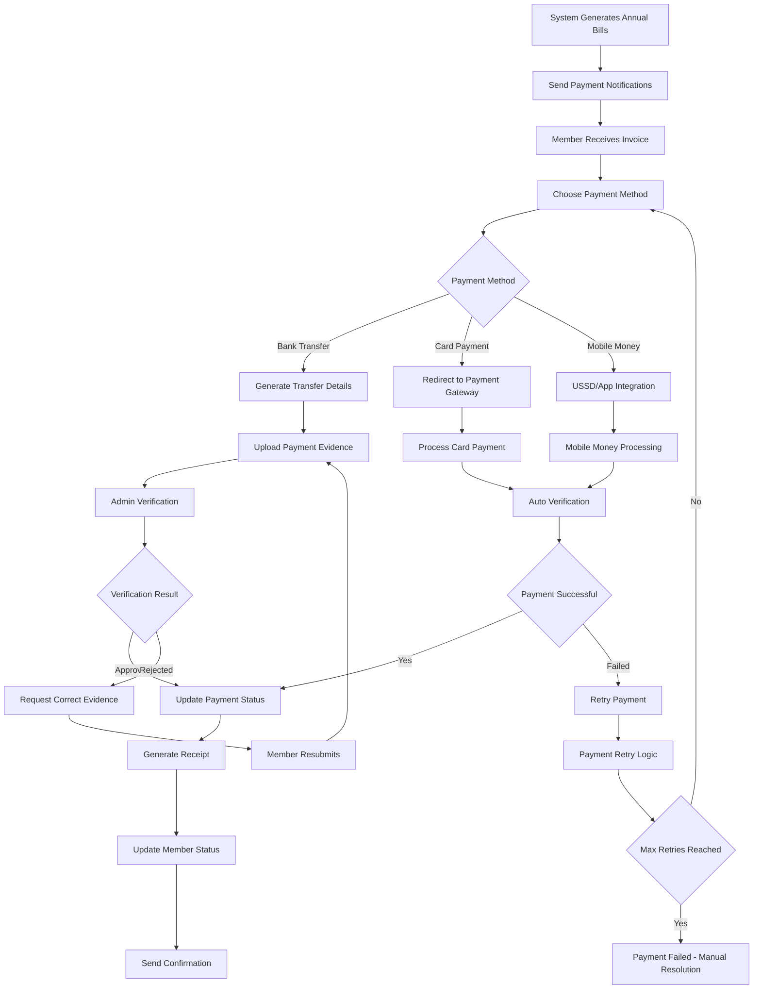

#### Payment Processing Logic
```typescript
interface PaymentWorkflow {
  duesCalculation: {
    baseDues: number
    discounts: {
      earlyPayment: 0.1      // 10% discount for early payment
      bulkPayment: 0.05      // 5% for paying multiple years
      studentRate: 0.5       // 50% discount for students
    }
    penalties: {
      lateFee: 0.02          // 2% per month late
      maxPenalty: 0.2        // 20% maximum penalty
    }
  }
  
  paymentMethods: {
    bankTransfer: {
      autoVerification: false
      processingTime: '1-3 business days'
      fees: 0
    }
    cardPayment: {
      autoVerification: true
      processingTime: 'immediate'
      fees: 0.015            // 1.5% transaction fee
    }
    mobileMoney: {
      autoVerification: true
      processingTime: 'immediate'
      fees: 0.01             // 1% transaction fee
    }
  }
}
```

## 7. 🔄 GoMed Integration Workflows

### 7.1 Pharmacist Onboarding to GoMed

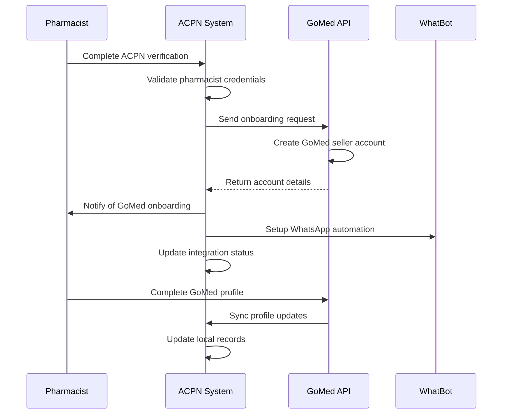

### 7.2 Order Fulfillment Workflow

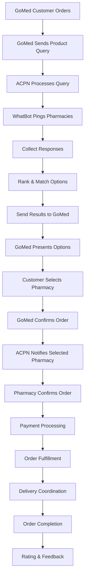

## 8. 📊 Analytics & Intelligence Workflows

### 8.1 Market Intelligence Generation

```typescript
interface IntelligenceWorkflow {
  dataCollection: {
    sources: [
      'marketplace_requests',
      'whatbot_responses', 
      'gomed_orders',
      'price_data',
      'inventory_levels'
    ]
    frequency: 'real_time'
    aggregation: 'hourly_daily_weekly'
  }
  
  analysis: {
    demandForecasting: {
      algorithm: 'arima_lstm_ensemble'
      factors: ['seasonality', 'trends', 'external_events']
      accuracy_target: 0.85
    }
    
    priceOptimization: {
      model: 'dynamic_pricing'
      constraints: ['minimum_margin', 'market_competition']
      update_frequency: 'daily'
    }
    
    supplyGapAnalysis: {
      detection: 'unsatisfied_requests'
      notification: 'immediate_for_critical_drugs'
      recommendation: 'supplier_outreach'
    }
  }
  
  reporting: {
    stakeholders: ['pharmacists', 'wholesalers', 'gomed', 'administrators']
    formats: ['dashboard', 'email_digest', 'api_feed']
    personalization: 'role_based_filtering'
  }
}
```

### 8.2 Performance Monitoring Workflow

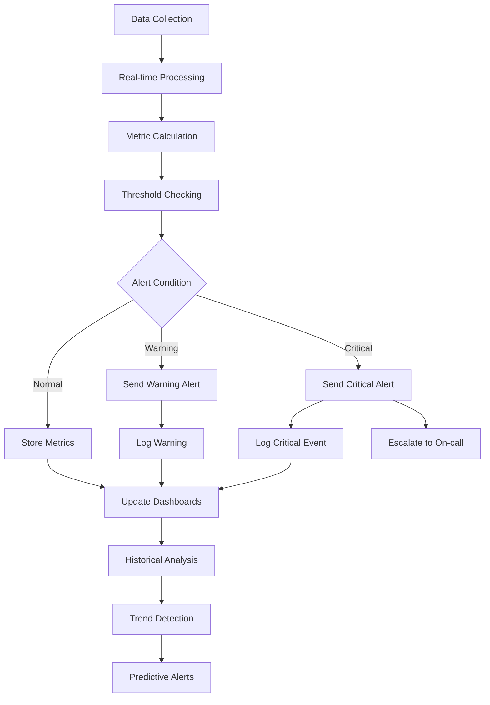

## 🔗 **Comprehensive Integration Architecture**

### **External System Integration Map**

```mermaid
graph TB
    subgraph "ACPN Portal Core System"
        CORE_API[Core API Gateway]
        USER_SVC[User Service]
        PHARMACY_SVC[Pharmacy Service]
        CPD_SVC[CPD Service]
        EVENT_SVC[Event Service]
        MARKETPLACE_SVC[Marketplace Service]
        TRADE_SVC[Trade Service]
        NOTIFICATION_SVC[Notification Service]
    end
    
    subgraph "Government & Regulatory APIs"
        PCN_API[PCN Database API]
        NAFDAC_API[NAFDAC Registry API]
        CUSTOMS_API[Nigeria Customs API]
        CAC_API[Corporate Affairs Commission]
        FIRS_API[Federal Inland Revenue Service]
    end
    
    subgraph "Financial & Payment Systems"
        PAYSTACK[Paystack Payment Gateway]
        FLUTTERWAVE[Flutterwave Payment Gateway]
        BANK_API[Commercial Bank APIs]
        NIBSS[Nigeria Inter-Bank Settlement System]
        REMITA[Remita Payment Platform]
    end
    
    subgraph "Communication Platforms"
        WHATSAPP_BIZ[WhatsApp Business API]
        SENDGRID[SendGrid Email Service]
        TWILIO[Twilio SMS Gateway]
        FCM[Firebase Cloud Messaging]
        SLACK[Slack Integration]
    end
    
    subgraph "Learning & Collaboration"
        BBB[BigBlueButton Server]
        ZOOM[Zoom API]
        SCORM[SCORM Cloud]
        YOUTUBE[YouTube API]
        GOOGLE_DRIVE[Google Drive API]
    end
    
    subgraph "Marketplace & E-commerce"
        GOMED[GoMed Platform]
        LOGISTICS_API[Logistics Partners API]
        INVENTORY_SYNC[Inventory Sync APIs]
        PRODUCT_DB[Product Database APIs]
    end
    
    subgraph "Analytics & Monitoring"
        GOOGLE_ANALYTICS[Google Analytics]
        MIXPANEL[Mixpanel Analytics]
        SENTRY[Sentry Error Tracking]
        DATADOG[Datadog Monitoring]
        NEW_RELIC[New Relic APM]
    end
    
    %% Core to Government APIs
    USER_SVC --> PCN_API
    PHARMACY_SVC --> NAFDAC_API
    TRADE_SVC --> CUSTOMS_API
    USER_SVC --> CAC_API
    TRADE_SVC --> FIRS_API
    
    %% Core to Financial Systems
    EVENT_SVC --> PAYSTACK
    TRADE_SVC --> FLUTTERWAVE
    MARKETPLACE_SVC --> BANK_API
    TRADE_SVC --> NIBSS
    EVENT_SVC --> REMITA
    
    %% Core to Communication
    NOTIFICATION_SVC --> WHATSAPP_BIZ
    NOTIFICATION_SVC --> SENDGRID
    NOTIFICATION_SVC --> TWILIO
    NOTIFICATION_SVC --> FCM
    CORE_API --> SLACK
    
    %% Core to Learning Platforms
    CPD_SVC --> BBB
    CPD_SVC --> ZOOM
    CPD_SVC --> SCORM
    CPD_SVC --> YOUTUBE
    CPD_SVC --> GOOGLE_DRIVE
    
    %% Core to Marketplace
    MARKETPLACE_SVC --> GOMED
    TRADE_SVC --> LOGISTICS_API
    PHARMACY_SVC --> INVENTORY_SYNC
    MARKETPLACE_SVC --> PRODUCT_DB
    
    %% Core to Analytics
    ALL_SERVICES --> GOOGLE_ANALYTICS
    ALL_SERVICES --> MIXPANEL
    ALL_SERVICES --> SENTRY
    ALL_SERVICES --> DATADOG
    ALL_SERVICES --> NEW_RELIC
```

### **Real-Time Data Synchronization Flow**

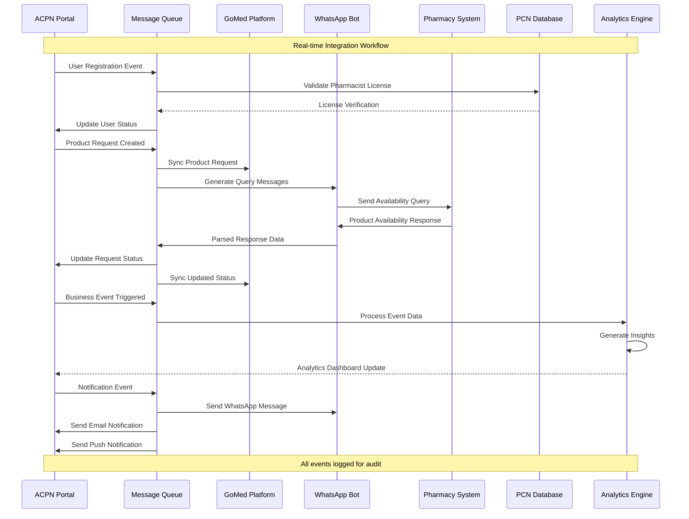

### **Error Handling & Recovery Architecture**

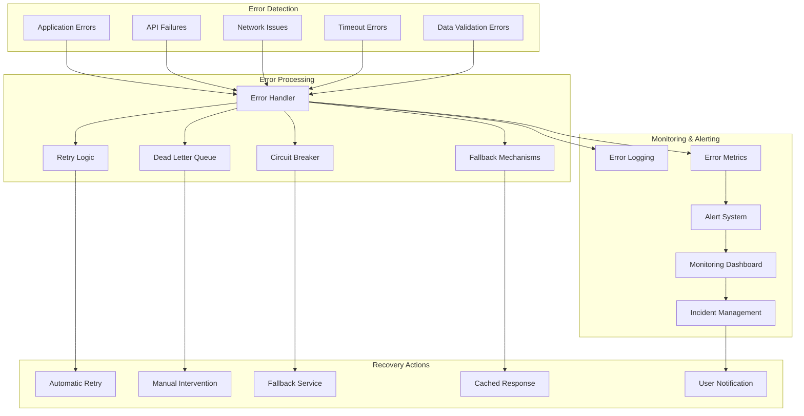

## 🚀 **Deployment & DevOps Architecture**

### **CI/CD Pipeline Architecture**

```mermaid
graph LR
    subgraph "Development"
        DEV_CODE[Developer Code]
        FEATURE_BRANCH[Feature Branch]
        CODE_REVIEW[Code Review]
        MERGE[Merge to Main]
    end
    
    subgraph "Continuous Integration"
        CI_TRIGGER[CI Trigger]
        CODE_CHECKOUT[Code Checkout]
        DEPENDENCY_INSTALL[Install Dependencies]
        UNIT_TESTS[Unit Tests]
        INTEGRATION_TESTS[Integration Tests]
        CODE_QUALITY[Code Quality Check]
        SECURITY_SCAN[Security Scan]
        BUILD_ARTIFACTS[Build Artifacts]
    end
    
    subgraph "Continuous Deployment"
        STAGING_DEPLOY[Deploy to Staging]
        E2E_TESTS[E2E Tests]
        PERFORMANCE_TESTS[Performance Tests]
        APPROVAL[Manual Approval]
        PRODUCTION_DEPLOY[Deploy to Production]
        SMOKE_TESTS[Smoke Tests]
        MONITORING[Post-Deploy Monitoring]
    end
    
    subgraph "Infrastructure"
        DOCKER_BUILD[Docker Build]
        REGISTRY_PUSH[Push to Registry]
        SWARM_DEPLOY[Docker Swarm Deploy]
        HEALTH_CHECK[Health Checks]
        ROLLBACK[Rollback Strategy]
    end
    
    DEV_CODE --> FEATURE_BRANCH
    FEATURE_BRANCH --> CODE_REVIEW
    CODE_REVIEW --> MERGE
    MERGE --> CI_TRIGGER
    
    CI_TRIGGER --> CODE_CHECKOUT
    CODE_CHECKOUT --> DEPENDENCY_INSTALL
    DEPENDENCY_INSTALL --> UNIT_TESTS
    UNIT_TESTS --> INTEGRATION_TESTS
    INTEGRATION_TESTS --> CODE_QUALITY
    CODE_QUALITY --> SECURITY_SCAN
    SECURITY_SCAN --> BUILD_ARTIFACTS
    
    BUILD_ARTIFACTS --> DOCKER_BUILD
    DOCKER_BUILD --> REGISTRY_PUSH
    REGISTRY_PUSH --> STAGING_DEPLOY
    
    STAGING_DEPLOY --> E2E_TESTS
    E2E_TESTS --> PERFORMANCE_TESTS
    PERFORMANCE_TESTS --> APPROVAL
    APPROVAL --> SWARM_DEPLOY
    SWARM_DEPLOY --> PRODUCTION_DEPLOY
    
    PRODUCTION_DEPLOY --> SMOKE_TESTS
    SMOKE_TESTS --> HEALTH_CHECK
    HEALTH_CHECK --> MONITORING
    
    HEALTH_CHECK -.->|Failure| ROLLBACK
    ROLLBACK --> SWARM_DEPLOY
```

### **Infrastructure as Code Architecture**

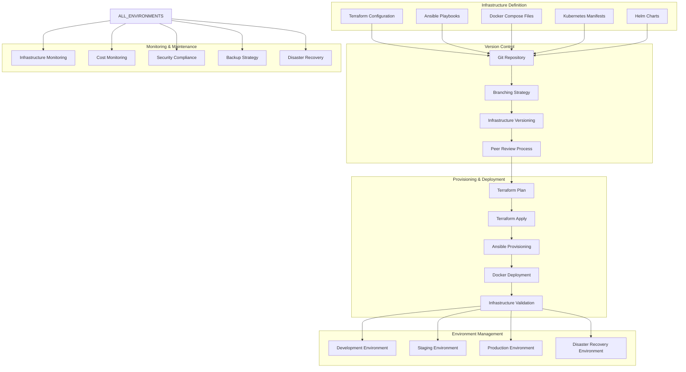

### **Monitoring & Observability Stack**

```mermaid
graph TD
    subgraph "Data Collection"
        APP_METRICS[Application Metrics]
        SYSTEM_METRICS[System Metrics]
        LOG_DATA[Log Data]
        TRACE_DATA[Trace Data]
        USER_EVENTS[User Events]
    end
    
    subgraph "Data Processing"
        PROMETHEUS[Prometheus]
        LOKI[Loki]
        JAEGER[Jaeger]
        ELASTICSEARCH[Elasticsearch]
        LOGSTASH[Logstash]
    end
    
    subgraph "Visualization & Alerting"
        GRAFANA[Grafana Dashboards]
        KIBANA[Kibana]
        ALERTMANAGER[Alert Manager]
        PAGERDUTY[PagerDuty]
        SLACK_ALERTS[Slack Alerts]
    end
    
    subgraph "Analysis & Intelligence"
        ANALYTICS_ENGINE[Analytics Engine]
        ANOMALY_DETECTION[Anomaly Detection]
        CAPACITY_PLANNING[Capacity Planning]
        PERFORMANCE_ANALYSIS[Performance Analysis]
        COST_ANALYSIS[Cost Analysis]
    end
    
    APP_METRICS --> PROMETHEUS
    SYSTEM_METRICS --> PROMETHEUS
    LOG_DATA --> LOKI
    LOG_DATA --> LOGSTASH
    TRACE_DATA --> JAEGER
    USER_EVENTS --> ELASTICSEARCH
    
    PROMETHEUS --> GRAFANA
    LOKI --> GRAFANA
    JAEGER --> GRAFANA
    ELASTICSEARCH --> KIBANA
    LOGSTASH --> ELASTICSEARCH
    
    PROMETHEUS --> ALERTMANAGER
    ALERTMANAGER --> PAGERDUTY
    ALERTMANAGER --> SLACK_ALERTS
    
    PROMETHEUS --> ANALYTICS_ENGINE
    ELASTICSEARCH --> ANALYTICS_ENGINE
    ANALYTICS_ENGINE --> ANOMALY_DETECTION
    ANALYTICS_ENGINE --> CAPACITY_PLANNING
    ANALYTICS_ENGINE --> PERFORMANCE_ANALYSIS
    ANALYTICS_ENGINE --> COST_ANALYSIS
    
    GRAFANA --> CAPACITY_PLANNING
    KIBANA --> PERFORMANCE_ANALYSIS
```

## 📊 **Business Intelligence & Analytics Architecture**

### **Analytics Data Pipeline**

```mermaid
graph LR
    subgraph "Data Sources"
        USER_INTERACTIONS[User Interactions]
        BUSINESS_TRANSACTIONS[Business Transactions]
        SYSTEM_EVENTS[System Events]
        EXTERNAL_DATA[External Data Sources]
        IoT_SENSORS[IoT Sensors]
    end
    
    subgraph "Data Ingestion"
        REAL_TIME_STREAM[Real-time Streaming]
        BATCH_PROCESSING[Batch Processing]
        API_INGESTION[API Ingestion]
        FILE_INGESTION[File Ingestion]
    end
    
    subgraph "Data Processing"
        ETL_PIPELINE[ETL Pipeline]
        DATA_VALIDATION[Data Validation]
        DATA_ENRICHMENT[Data Enrichment]
        DATA_TRANSFORMATION[Data Transformation]
        DATA_QUALITY[Data Quality Checks]
    end
    
    subgraph "Data Storage"
        DATA_LAKE[Data Lake]
        DATA_WAREHOUSE[Data Warehouse]
        OLAP_CUBES[OLAP Cubes]
        TIME_SERIES_DB[Time Series Database]
    end
    
    subgraph "Analytics & ML"
        DESCRIPTIVE_ANALYTICS[Descriptive Analytics]
        PREDICTIVE_ANALYTICS[Predictive Analytics]
        PRESCRIPTIVE_ANALYTICS[Prescriptive Analytics]
        ML_MODELS[Machine Learning Models]
        AI_INSIGHTS[AI-driven Insights]
    end
    
    subgraph "Visualization & Reporting"
        EXECUTIVE_DASHBOARD[Executive Dashboard]
        OPERATIONAL_DASHBOARD[Operational Dashboard]
        CUSTOM_REPORTS[Custom Reports]
        MOBILE_REPORTS[Mobile Reports]
        AUTOMATED_ALERTS[Automated Alerts]
    end
    
    USER_INTERACTIONS --> REAL_TIME_STREAM
    BUSINESS_TRANSACTIONS --> BATCH_PROCESSING
    SYSTEM_EVENTS --> API_INGESTION
    EXTERNAL_DATA --> FILE_INGESTION
    IoT_SENSORS --> REAL_TIME_STREAM
    
    REAL_TIME_STREAM --> ETL_PIPELINE
    BATCH_PROCESSING --> ETL_PIPELINE
    API_INGESTION --> DATA_VALIDATION
    FILE_INGESTION --> DATA_VALIDATION
    
    ETL_PIPELINE --> DATA_ENRICHMENT
    DATA_VALIDATION --> DATA_TRANSFORMATION
    DATA_ENRICHMENT --> DATA_QUALITY
    DATA_TRANSFORMATION --> DATA_QUALITY
    
    DATA_QUALITY --> DATA_LAKE
    DATA_QUALITY --> DATA_WAREHOUSE
    DATA_WAREHOUSE --> OLAP_CUBES
    DATA_LAKE --> TIME_SERIES_DB
    
    DATA_WAREHOUSE --> DESCRIPTIVE_ANALYTICS
    TIME_SERIES_DB --> PREDICTIVE_ANALYTICS
    OLAP_CUBES --> PRESCRIPTIVE_ANALYTICS
    DATA_LAKE --> ML_MODELS
    ML_MODELS --> AI_INSIGHTS
    
    DESCRIPTIVE_ANALYTICS --> EXECUTIVE_DASHBOARD
    PREDICTIVE_ANALYTICS --> OPERATIONAL_DASHBOARD
    PRESCRIPTIVE_ANALYTICS --> CUSTOM_REPORTS
    AI_INSIGHTS --> MOBILE_REPORTS
    ALL_ANALYTICS --> AUTOMATED_ALERTS
```

This comprehensive architecture documentation provides complete visibility into the ACPN Portal's systems, data flows, integrations, security measures, and operational processes. The diagrams illustrate how all components work together to deliver a robust, scalable, and secure pharmaceutical management platform. 