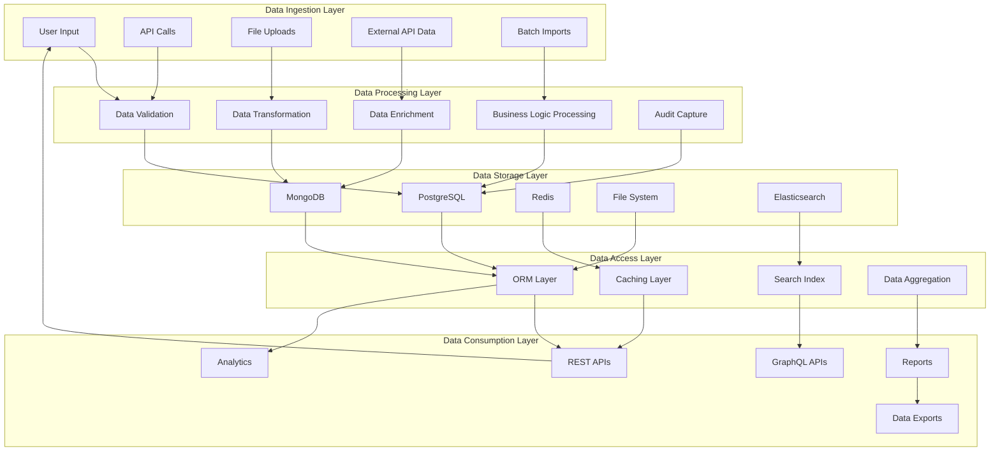

# Core Data Models

> **Comprehensive Data Models for ACPN Lagos Portal**

Complete TypeScript interfaces and data structures for all core entities in the system.

---

## 🗄️ Database Schema Overview

The ACPN Portal uses a hybrid approach with PostgreSQL for relational data and MongoDB for document-based data like product catalogs and user activity logs.

### **Complete Data Architecture**

```mermaid
graph TB
    subgraph "Application Layer"
        USER_APP[User Management]
        PHARMACY_APP[Pharmacy Management]
        CPD_APP[CPD Learning]
        EVENT_APP[Events Management]
        MARKETPLACE_APP[Marketplace]
        TRADE_APP[Wholesale-Retail Trade]
        ANALYTICS_APP[Analytics & Reporting]
    end
    
    subgraph "Data Access Layer"
        ORM[TypeORM/Prisma ORM]
        ODM[Mongoose ODM]
        CACHE_LAYER[Redis Cache Layer]
        SEARCH_LAYER[Elasticsearch]
        QUEUE_LAYER[Bull Queue System]
    end
    
    subgraph "PostgreSQL - Relational Data"
        PG_USERS[(Users & Authentication)]
        PG_PHARMACY[(Pharmacy Management)]
        PG_CPD[(CPD & Learning)]
        PG_EVENTS[(Events & Registrations)]
        PG_FINANCIAL[(Financial Transactions)]
        PG_AUDIT[(Audit & Compliance)]
        PG_SYSTEM[(System Configuration)]
    end
    
    subgraph "MongoDB - Document Data"
        MONGO_PRODUCTS[(Product Catalogs)]
        MONGO_CONTENT[(Learning Content)]
        MONGO_LOGS[(Activity Logs)]
        MONGO_ANALYTICS[(Analytics Data)]
        MONGO_NOTIFICATIONS[(Notifications)]
        MONGO_MEDIA[(Media Metadata)]
    end
    
    subgraph "Redis - Cache & Sessions"
        REDIS_CACHE[(Application Cache)]
        REDIS_SESSIONS[(User Sessions)]
        REDIS_QUEUE[(Job Queue)]
        REDIS_PUBSUB[(Real-time Events)]
    end
    
    subgraph "File System"
        FS_DOCUMENTS[Documents & Certificates]
        FS_MEDIA[Images & Videos]
        FS_BACKUPS[Database Backups]
        FS_LOGS[Application Logs]
    end
    
    USER_APP --> ORM
    PHARMACY_APP --> ORM
    CPD_APP --> ORM
    EVENT_APP --> ORM
    MARKETPLACE_APP --> ORM
    TRADE_APP --> ORM
    ANALYTICS_APP --> ODM
    
    ORM --> PG_USERS
    ORM --> PG_PHARMACY
    ORM --> PG_CPD
    ORM --> PG_EVENTS
    ORM --> PG_FINANCIAL
    ORM --> PG_AUDIT
    ORM --> PG_SYSTEM
    
    ODM --> MONGO_PRODUCTS
    ODM --> MONGO_CONTENT
    ODM --> MONGO_LOGS
    ODM --> MONGO_ANALYTICS
    ODM --> MONGO_NOTIFICATIONS
    ODM --> MONGO_MEDIA
    
    ALL_APPS --> CACHE_LAYER
    CACHE_LAYER --> REDIS_CACHE
    CACHE_LAYER --> REDIS_SESSIONS
    
    ALL_APPS --> QUEUE_LAYER
    QUEUE_LAYER --> REDIS_QUEUE
    QUEUE_LAYER --> REDIS_PUBSUB
    
    ALL_APPS --> SEARCH_LAYER
    SEARCH_LAYER --> PG_USERS
    SEARCH_LAYER --> MONGO_PRODUCTS
    
    ALL_APPS --> FS_DOCUMENTS
    ALL_APPS --> FS_MEDIA
    QUEUE_LAYER --> FS_BACKUPS
    ALL_APPS --> FS_LOGS
```



### **Comprehensive Entity Relationship Diagram**

```mermaid
erDiagram
    %% User Management Domain
    USER {
        uuid id PK
        string email UK
        string password_hash
        enum role
        enum status
        timestamp created_at
        timestamp updated_at
        timestamp last_login_at
        uuid created_by FK
    }
    
    USER_PROFILE {
        uuid id PK
        uuid user_id FK
        string first_name
        string last_name
        string phone_number
        date date_of_birth
        enum gender
        jsonb address
        jsonb emergency_contact
        timestamp created_at
        timestamp updated_at
    }
    
    USER_PROFESSIONAL_DATA {
        uuid id PK
        uuid user_id FK
        string license_number UK
        date license_expiry
        string[] specializations
        jsonb education
        jsonb certifications
        jsonb work_experience
        boolean verified
        timestamp verified_at
    }
    
    %% Pharmacy Management Domain
    PHARMACY {
        uuid id PK
        string name
        string license_number UK
        jsonb address
        jsonb contact_info
        uuid owner_id FK
        enum status
        jsonb operating_hours
        decimal latitude
        decimal longitude
        timestamp created_at
        timestamp updated_at
    }
    
    PHARMACY_STAFF {
        uuid id PK
        uuid pharmacy_id FK
        uuid user_id FK
        enum role
        enum employment_type
        date start_date
        date end_date
        jsonb permissions
        timestamp created_at
    }
    
    PHARMACY_INVENTORY {
        uuid id PK
        uuid pharmacy_id FK
        string product_sku
        string product_name
        integer quantity_available
        integer quantity_reserved
        decimal unit_price
        date expiry_date
        string batch_number
        timestamp updated_at
    }
    
    %% CPD & Learning Domain
    CPD_COURSE {
        uuid id PK
        string title
        text description
        integer credit_hours
        enum course_type
        enum status
        uuid instructor_id FK
        jsonb content_structure
        jsonb assessment_config
        timestamp created_at
        timestamp updated_at
    }
    
    CPD_ENROLLMENT {
        uuid id PK
        uuid course_id FK
        uuid user_id FK
        enum status
        timestamp enrolled_at
        timestamp started_at
        timestamp completed_at
        integer progress_percentage
        decimal final_score
    }
    
    CPD_CERTIFICATE {
        uuid id PK
        uuid enrollment_id FK
        uuid user_id FK
        uuid course_id FK
        string certificate_number UK
        integer credits_earned
        date issue_date
        date expiry_date
        string file_path
        enum verification_status
    }
    
    %% Events Management Domain
    EVENT {
        uuid id PK
        string title
        text description
        enum event_type
        enum category
        timestamp start_date
        timestamp end_date
        jsonb venue_details
        integer capacity
        integer current_registrations
        jsonb pricing_config
        jsonb cpd_config
        enum status
        uuid organizer_id FK
        timestamp created_at
    }
    
    EVENT_REGISTRATION {
        uuid id PK
        uuid event_id FK
        uuid user_id FK
        enum registration_type
        jsonb attendee_info
        jsonb payment_info
        enum status
        boolean checked_in
        timestamp checked_in_at
        timestamp registered_at
    }
    
    EVENT_SESSION {
        uuid id PK
        uuid event_id FK
        string title
        text description
        timestamp start_time
        timestamp end_time
        string location
        uuid speaker_id FK
        jsonb materials
        enum session_type
    }
    
    %% Marketplace Domain
    MARKETPLACE_REQUEST {
        uuid id PK
        string title
        text description
        string product_name
        integer quantity
        string unit
        enum urgency
        jsonb location_data
        uuid requester_id FK
        enum status
        timestamp created_at
        timestamp expires_at
    }
    
    MARKETPLACE_OFFER {
        uuid id PK
        uuid request_id FK
        uuid offerer_id FK
        uuid pharmacy_id FK
        jsonb product_info
        integer quantity
        decimal unit_price
        decimal total_price
        jsonb delivery_options
        text message
        enum status
        timestamp created_at
        timestamp expires_at
    }
    
    MARKETPLACE_ORDER {
        uuid id PK
        uuid request_id FK
        uuid offer_id FK
        uuid buyer_id FK
        uuid seller_id FK
        decimal total_amount
        enum payment_method
        enum status
        jsonb delivery_details
        timestamp created_at
        timestamp fulfilled_at
    }
    
    %% Wholesale-Retail Trade Domain
    WHOLESALE_PRODUCT {
        uuid id PK
        string sku UK
        string nafdac_number
        string brand_name
        string generic_name
        string manufacturer
        jsonb specifications
        jsonb regulatory_info
        decimal wholesale_price
        decimal suggested_retail_price
        integer minimum_order_quantity
        uuid supplier_id FK
        timestamp created_at
        timestamp updated_at
    }
    
    TRADE_RELATIONSHIP {
        uuid id PK
        uuid wholesaler_id FK
        uuid retailer_id FK
        decimal credit_limit
        jsonb payment_terms
        enum status
        decimal trust_score
        timestamp established_date
        timestamp last_transaction_date
    }
    
    TRADE_ORDER {
        uuid id PK
        uuid buyer_id FK
        uuid seller_id FK
        string order_number UK
        decimal total_amount
        enum payment_terms
        enum status
        jsonb delivery_info
        timestamp created_at
        timestamp expected_delivery
        timestamp delivered_at
    }
    
    TRADE_ORDER_ITEM {
        uuid id PK
        uuid order_id FK
        uuid product_id FK
        integer quantity
        decimal unit_price
        decimal line_total
        string batch_number
        date expiry_date
    }
    
    %% Financial Domain
    PAYMENT_TRANSACTION {
        uuid id PK
        uuid user_id FK
        uuid related_entity_id FK
        enum entity_type
        decimal amount
        string currency
        enum payment_method
        enum status
        string transaction_reference UK
        string gateway_reference
        jsonb gateway_response
        timestamp created_at
        timestamp processed_at
    }
    
    INVOICE {
        uuid id PK
        string invoice_number UK
        uuid biller_id FK
        uuid payee_id FK
        decimal subtotal
        decimal tax_amount
        decimal total_amount
        enum status
        date due_date
        jsonb line_items
        timestamp created_at
        timestamp paid_at
    }
    
    %% System & Audit Domain
    AUDIT_LOG {
        uuid id PK
        uuid user_id FK
        string action
        string entity_type
        uuid entity_id
        jsonb old_values
        jsonb new_values
        string ip_address
        string user_agent
        timestamp created_at
    }
    
    SYSTEM_CONFIGURATION {
        uuid id PK
        string config_key UK
        string config_value
        enum data_type
        text description
        boolean is_encrypted
        uuid updated_by FK
        timestamp updated_at
    }
    
    NOTIFICATION {
        uuid id PK
        uuid user_id FK
        string type
        string title
        text content
        jsonb data
        enum channel
        enum status
        timestamp scheduled_at
        timestamp sent_at
        timestamp read_at
    }
    
    %% Relationships
    USER ||--|| USER_PROFILE : has
    USER ||--|| USER_PROFESSIONAL_DATA : has
    USER ||--o{ PHARMACY : owns
    USER ||--o{ PHARMACY_STAFF : assigned_to
    USER ||--o{ CPD_ENROLLMENT : enrolls_in
    USER ||--o{ EVENT_REGISTRATION : registers_for
    USER ||--o{ MARKETPLACE_REQUEST : creates
    USER ||--o{ MARKETPLACE_OFFER : makes
    USER ||--o{ TRADE_ORDER : places
    USER ||--o{ PAYMENT_TRANSACTION : makes
    USER ||--o{ AUDIT_LOG : generates
    USER ||--o{ NOTIFICATION : receives
    
    PHARMACY ||--o{ PHARMACY_STAFF : employs
    PHARMACY ||--o{ PHARMACY_INVENTORY : maintains
    PHARMACY ||--o{ MARKETPLACE_OFFER : offers_through
    PHARMACY ||--o{ TRADE_RELATIONSHIP : participates_in
    
    CPD_COURSE ||--o{ CPD_ENROLLMENT : has
    CPD_ENROLLMENT ||--|| CPD_CERTIFICATE : generates
    
    EVENT ||--o{ EVENT_REGISTRATION : accepts
    EVENT ||--o{ EVENT_SESSION : contains
    EVENT_REGISTRATION ||--o{ PAYMENT_TRANSACTION : requires
    
    MARKETPLACE_REQUEST ||--o{ MARKETPLACE_OFFER : receives
    MARKETPLACE_OFFER ||--o{ MARKETPLACE_ORDER : becomes
    
    WHOLESALE_PRODUCT ||--o{ TRADE_ORDER_ITEM : included_in
    TRADE_ORDER ||--o{ TRADE_ORDER_ITEM : contains
    TRADE_ORDER ||--o{ PAYMENT_TRANSACTION : requires
    TRADE_RELATIONSHIP ||--o{ TRADE_ORDER : facilitates
    
    PAYMENT_TRANSACTION ||--|| INVOICE : settles
    
    SYSTEM_CONFIGURATION ||--o{ AUDIT_LOG : tracks_changes
```



### **Data Flow Architecture**



## 👤 **User Models**

```typescript
interface User {
  id: string;
  email: string;
  firstName: string;
  lastName: string;
  phoneNumber: string;
  primaryRole: UserRole;
  isActive: boolean;
  createdAt: Date;
  updatedAt: Date;
}

enum UserRole {
  SUPER_ADMIN = 'super_admin',
  PHARMACY_OWNER = 'pharmacy_owner',
  RESIDENT_PHARMACIST = 'resident_pharmacist',
  PHARMACY_STAFF = 'pharmacy_staff',
  DOCTOR = 'doctor'
}
```

### User Base Model

```typescript
interface User {
  id: string                    // UUID primary key
  email: string                 // Unique, indexed
  emailVerified: boolean
  emailVerifiedAt?: Date
  passwordHash: string          // bcrypt hashed
  role: UserRole
  status: UserStatus
  createdAt: Date
  updatedAt: Date
  lastLoginAt?: Date
  profileImage?: string
  preferences: UserPreferences
  
  // Relationship IDs
  profileId: string             // References UserProfile
  
  // Security
  twoFactorEnabled: boolean
  twoFactorSecret?: string
  backupCodes?: string[]
  lastPasswordChange: Date
  failedLoginAttempts: number
  lockedUntil?: Date
  
  // Audit
  createdBy?: string
  updatedBy?: string
  deletedAt?: Date
}

type UserStatus = 'pending' | 'active' | 'suspended' | 'disabled' | 'archived'

interface UserPreferences {
  language: 'en' | 'yo' | 'ha' | 'ig'
  timezone: string
  currency: 'NGN' | 'USD'
  notifications: {
    email: NotificationSettings
    sms: NotificationSettings
    push: NotificationSettings
    whatsapp: NotificationSettings
  }
  dashboard: {
    defaultView: string
    widgetsEnabled: string[]
    refreshInterval: number
  }
  marketplace: {
    defaultRadius: number
    priceAlerts: boolean
    autoRespond: boolean
  }
}

interface NotificationSettings {
  enabled: boolean
  frequency: 'instant' | 'daily' | 'weekly'
  types: string[]
}
```

### User Profile Model

```typescript
interface UserProfile {
  id: string
  userId: string               // Foreign key to User
  firstName: string
  lastName: string
  middleName?: string
  phoneNumber: string
  alternatePhone?: string
  dateOfBirth?: Date
  gender?: 'male' | 'female' | 'other'
  nationality: string
  stateOfOrigin?: string
  address: Address
  
  // Professional Information
  professionalData: ProfessionalData
  
  // Verification Status
  verification: VerificationStatus
  
  // Social Links
  socialLinks?: {
    linkedin?: string
    twitter?: string
    facebook?: string
    website?: string
  }
  
  // Emergency Contact
  emergencyContact?: {
    name: string
    relationship: string
    phoneNumber: string
    email?: string
  }
  
  createdAt: Date
  updatedAt: Date
}

interface Address {
  street: string
  city: string
  state: string
  country: string
  postalCode?: string
  coordinates?: {
    latitude: number
    longitude: number
    accuracy?: number
  }
  verified: boolean
  verifiedAt?: Date
}

interface ProfessionalData {
  licenseNumber: string        // PCN for pharmacists, Medical License for doctors
  licenseExpiry: Date
  specialization?: string[]
  education: Education[]
  certifications: Certification[]
  workExperience: WorkExperience[]
  memberships: ProfessionalMembership[]
}

interface Education {
  institution: string
  degree: string
  field: string
  startYear: number
  endYear: number
  cgpa?: number
  verified: boolean
  documents?: string[]
}

interface Certification {
  name: string
  issuingOrganization: string
  issueDate: Date
  expiryDate?: Date
  credentialId?: string
  verified: boolean
  documents?: string[]
}

interface WorkExperience {
  organization: string
  position: string
  startDate: Date
  endDate?: Date
  current: boolean
  description?: string
  responsibilities?: string[]
  verified: boolean
}

interface ProfessionalMembership {
  organization: string
  membershipType: string
  membershipNumber?: string
  startDate: Date
  endDate?: Date
  active: boolean
  verified: boolean
}

interface VerificationStatus {
  identity: {
    verified: boolean
    method?: 'nin' | 'passport' | 'drivers_license'
    verifiedAt?: Date
    document?: string
  }
  professional: {
    verified: boolean
    method?: 'pcn_database' | 'manual_review'
    verifiedAt?: Date
    verifiedBy?: string
    documents?: string[]
  }
  address: {
    verified: boolean
    method?: 'utility_bill' | 'bank_statement' | 'gps'
    verifiedAt?: Date
    documents?: string[]
  }
  phone: {
    verified: boolean
    verifiedAt?: Date
    method?: 'sms' | 'call'
  }
}
```

## 🏥 **Pharmacy Models**

```typescript
interface Pharmacy {
  id: string;
  name: string;
  address: Address;
  owner: string; // User ID
  residentPharmacist: string; // User ID
  status: 'active' | 'inactive' | 'suspended';
  createdAt: Date;
  updatedAt: Date;
}

interface Address {
  street: string;
  city: string;
  state: string;
  country: string;
  coordinates?: {
    latitude: number;
    longitude: number;
  };
}
```

### Pharmacy Model

```typescript
interface Pharmacy {
  id: string                   // UUID primary key
  name: string
  tradeName?: string
  registrationNumber: string   // Pharmacy premises license
  ownerUserId: string         // Foreign key to User
  managerId?: string          // Foreign key to User
  
  // Location Information
  address: Address
  geoVerified: boolean
  geoVerifiedAt?: Date
  
  // Contact Information
  phoneNumber: string
  alternatePhone?: string
  email?: string
  website?: string
  whatsappNumber?: string
  
  // Operating Information
  operatingHours: OperatingHours
  services: PharmacyService[]
  deliveryZones: DeliveryZone[]
  
  // Business Information
  businessInfo: {
    cacNumber?: string
    tinNumber?: string
    bankDetails?: BankDetails
    insuranceInfo?: InsuranceInfo
  }
  
  // Status and Verification
  status: PharmacyStatus
  verification: PharmacyVerification
  rating: PharmacyRating
  
  // Integration Settings
  integrations: {
    gomed: GoMedIntegration
    whatbot: WhatBotSettings
  }
  
  // Metadata
  tags: string[]
  metadata: Record<string, any>
  
  createdAt: Date
  updatedAt: Date
  createdBy: string
  updatedBy?: string
}

type PharmacyStatus = 'pending' | 'active' | 'suspended' | 'closed' | 'relocated'

interface OperatingHours {
  [day: string]: {
    isOpen: boolean
    openTime?: string
    closeTime?: string
    breaks?: Array<{
      startTime: string
      endTime: string
      description?: string
    }>
  }
  publicHolidays: {
    isOpen: boolean
    customHours?: {
      openTime: string
      closeTime: string
    }
  }
  specialDates?: Array<{
    date: Date
    isOpen: boolean
    customHours?: {
      openTime: string
      closeTime: string
    }
    reason?: string
  }>
}

interface PharmacyService {
  type: ServiceType
  available: boolean
  description?: string
  pricing?: ServicePricing
  requirements?: string[]
}

type ServiceType = 
  | 'prescription_dispensing'
  | 'otc_sales'
  | 'health_screening'
  | 'consultation'
  | 'immunization'
  | 'medication_therapy_management'
  | 'home_delivery'
  | 'online_ordering'
  | 'insurance_claims'

interface ServicePricing {
  type: 'fixed' | 'percentage' | 'variable'
  amount?: number
  percentage?: number
  currency: string
  description?: string
}

interface DeliveryZone {
  name: string
  boundary: {
    type: 'circle' | 'polygon'
    center?: { latitude: number; longitude: number }
    radius?: number  // in kilometers
    coordinates?: Array<{ latitude: number; longitude: number }>
  }
  deliveryFee: number
  minimumOrder?: number
  estimatedTime: {
    min: number    // in minutes
    max: number
  }
  active: boolean
}

interface BankDetails {
  bankName: string
  accountNumber: string
  accountName: string
  bankCode?: string
  branchCode?: string
  verified: boolean
  verifiedAt?: Date
}

interface InsuranceInfo {
  provider: string
  policyNumber: string
  coverage: string[]
  expiryDate: Date
  documents?: string[]
}

interface PharmacyVerification {
  premises: {
    verified: boolean
    verifiedAt?: Date
    verifiedBy?: string
    licenseNumber: string
    licenseExpiry: Date
    documents: string[]
  }
  pharmacist: {
    verified: boolean
    verifiedAt?: Date
    superintendentId: string
    alternatePharmacists: string[]
  }
  compliance: {
    nafdacCompliant: boolean
    pcnRegistered: boolean
    lastInspection?: Date
    inspectionScore?: number
    violations?: string[]
  }
}

interface PharmacyRating {
  overall: number
  reviewCount: number
  breakdown: {
    service: number
    pricing: number
    availability: number
    delivery: number
    quality: number
  }
  lastUpdated: Date
}

interface GoMedIntegration {
  enabled: boolean
  sellerId?: string
  apiKey?: string
  tier: 'standard' | 'premium' | 'priority'
  commissionRate: number
  autoSync: boolean
  lastSync?: Date
  settings: {
    autoAcceptOrders: boolean
    maxOrderValue?: number
    operatingHours?: OperatingHours
  }
}

interface WhatBotSettings {
  enabled: boolean
  autoRespond: boolean
  responseTemplate?: string
  responseDelay: number  // in seconds
  workingHours?: OperatingHours
  keywordFilters: string[]
  escalationRules: {
    noResponse: number     // minutes before escalation
    invalidResponse: number
    escalateTo: string[]   // user IDs
  }
}
```

### Pharmacy Staff Model

```typescript
interface PharmacyStaff {
  id: string
  pharmacyId: string          // Foreign key to Pharmacy
  userId: string              // Foreign key to User
  role: StaffRole
  permissions: Permission[]
  status: StaffStatus
  startDate: Date
  endDate?: Date
  salary?: SalaryInfo
  schedule?: WorkSchedule
  
  createdAt: Date
  updatedAt: Date
  createdBy: string
}

type StaffRole = 
  | 'superintendent_pharmacist'
  | 'pharmacist'
  | 'pharmacy_technician'
  | 'intern_pharmacist'
  | 'sales_rep'
  | 'manager'
  | 'cashier'
  | 'delivery_personnel'

type StaffStatus = 'active' | 'inactive' | 'suspended' | 'terminated'

interface Permission {
  resource: string
  actions: string[]
  conditions?: Record<string, any>
}

interface SalaryInfo {
  amount: number
  currency: string
  frequency: 'hourly' | 'daily' | 'weekly' | 'monthly' | 'yearly'
  bonus?: {
    type: 'fixed' | 'percentage'
    amount: number
    frequency: string
  }
}

interface WorkSchedule {
  type: 'fixed' | 'flexible' | 'rotating'
  hoursPerWeek: number
  shifts: Array<{
    day: string
    startTime: string
    endTime: string
    breakTime?: {
      startTime: string
      endTime: string
    }
  }>
}
```

## 📦 **Product Models**

```typescript
interface Product {
  id: string;
  name: string;
  brand: string;
  category: ProductCategory;
  price: number;
  status: 'active' | 'inactive';
  createdAt: Date;
  updatedAt: Date;
}

enum ProductCategory {
  PRESCRIPTION_MEDICINES = 'prescription_medicines',
  OTC_MEDICINES = 'otc_medicines',
  MEDICAL_DEVICES = 'medical_devices'
}
```

### Product Catalog Model

```typescript
interface Product {
  id: string
  sku: string                 // Stock Keeping Unit, unique identifier
  name: string
  genericName?: string
  brandName?: string
  manufacturer: string
  
  // Classification
  category: ProductCategory
  subcategory?: string
  therapeuticClass?: string
  drugClass?: string
  
  // Physical Properties
  form: ProductForm
  strength?: string
  packSize: string
  unitOfMeasure: string
  dimensions?: {
    length: number
    width: number
    height: number
    weight: number
    unit: string
  }
  
  // Regulatory Information
  nafdacNumber?: string
  scheduledDrug: boolean
  prescriptionRequired: boolean
  controlledSubstance: boolean
  
  // Content Information
  activeIngredients: ActiveIngredient[]
  inactiveIngredients?: string[]
  contraindications?: string[]
  sideEffects?: string[]
  interactions?: DrugInteraction[]
  
  // Pricing and Availability
  pricing: ProductPricing
  availability: ProductAvailability
  
  // Media and Documentation
  images: ProductImage[]
  documents: ProductDocument[]
  
  // Metadata
  tags: string[]
  searchKeywords: string[]
  barcode?: string
  qrCode?: string
  
  // Audit
  status: ProductStatus
  approvedBy?: string
  approvedAt?: Date
  createdAt: Date
  updatedAt: Date
  version: number
}

interface ProductCategory {
  id: string
  name: string
  code: string
  parentId?: string
  level: number
  path: string
  description?: string
}

type ProductForm = 
  | 'tablet'
  | 'capsule'
  | 'syrup'
  | 'injection'
  | 'cream'
  | 'ointment'
  | 'drops'
  | 'inhaler'
  | 'patch'
  | 'suppository'
  | 'powder'
  | 'solution'
  | 'gel'
  | 'spray'
  | 'other'

interface ActiveIngredient {
  name: string
  strength: string
  unit: string
  role: 'active' | 'preservative' | 'excipient'
}

interface DrugInteraction {
  drug: string
  severity: 'minor' | 'moderate' | 'major'
  description: string
  mechanism?: string
  management?: string
}

interface ProductPricing {
  msrp: number               // Manufacturer's Suggested Retail Price
  averageMarketPrice: number
  priceRange: {
    min: number
    max: number
  }
  currency: string
  priceHistory: Array<{
    date: Date
    price: number
    source: string
  }>
  lastUpdated: Date
}

interface ProductAvailability {
  inStock: boolean
  stockLevel: StockLevel
  reorderLevel: number
  leadTime: number           // in days
  seasonal: boolean
  seasonalMonths?: number[]
  discontinuedDate?: Date
  replacementProduct?: string
}

type StockLevel = 'high' | 'medium' | 'low' | 'out_of_stock' | 'discontinued'

interface ProductImage {
  id: string
  url: string
  type: ImageType
  altText?: string
  isPrimary: boolean
  order: number
}

type ImageType = 'product' | 'packaging' | 'label' | 'certificate' | 'other'

interface ProductDocument {
  id: string
  name: string
  type: DocumentType
  url: string
  description?: string
  uploadedAt: Date
  version?: string
}

type DocumentType = 
  | 'product_information'
  | 'prescribing_information'
  | 'safety_data_sheet'
  | 'certificate_of_analysis'
  | 'nafdac_certificate'
  | 'manufacturer_certificate'
  | 'package_insert'
  | 'other'

type ProductStatus = 'draft' | 'pending_approval' | 'active' | 'inactive' | 'discontinued'
```

### Inventory Model

```typescript
interface Inventory {
  id: string
  pharmacyId: string         // Foreign key to Pharmacy
  productId: string          // Foreign key to Product
  sku: string               // Product SKU for quick reference
  
  // Stock Information
  currentStock: number
  reservedStock: number      // Stock reserved for orders
  availableStock: number     // currentStock - reservedStock
  reorderLevel: number
  maxStockLevel: number
  
  // Batch Information
  batches: InventoryBatch[]
  
  // Pricing
  costPrice: number
  sellingPrice: number
  markup: number
  
  // Location in Pharmacy
  location: {
    section: string
    shelf: string
    position: string
  }
  
  // Settings
  autoReorder: boolean
  supplier: SupplierInfo
  
  // Audit
  lastStockCheck: Date
  lastUpdated: Date
  updatedBy: string
}

interface InventoryBatch {
  batchNumber: string
  expiryDate: Date
  quantity: number
  costPrice: number
  receivedDate: Date
  supplierId: string
  manufacturingDate?: Date
  qualityCheck: {
    passed: boolean
    checkedBy: string
    checkedAt: Date
    notes?: string
  }
  status: BatchStatus
}

type BatchStatus = 'active' | 'expired' | 'recalled' | 'damaged' | 'returned'

interface SupplierInfo {
  id: string
  name: string
  contactPerson: string
  phone: string
  email: string
  leadTime: number
  minimumOrder: number
  paymentTerms: string
  reliability: number        // 0-1 score
}
```

## 🛒 **Marketplace Models**

### Marketplace Request Model

```typescript
interface MarketplaceRequest {
  id: string
  requesterId: string        // Foreign key to User (Pharmacy)
  productId?: string         // Foreign key to Product (if exists in catalog)
  
  // Product Information
  productInfo: {
    name: string
    sku?: string
    category: string
    form?: string
    strength?: string
    packSize?: string
    manufacturer?: string
    description?: string
  }
  
  // Request Details
  quantity: number
  urgency: RequestUrgency
  maxPrice?: number
  currency: string
  deliveryRequirements: DeliveryRequirements
  
  // Location and Logistics
  deliveryLocation: Address
  pickupLocation?: Address
  preferredRadius: number    // in kilometers
  
  // Timing
  neededBy: Date
  validUntil: Date
  
  // Request Status
  status: RequestStatus
  visibility: RequestVisibility
  
  // Offers and Responses
  offers: MarketplaceOffer[]
  offerCount: number
  viewCount: number
  
  // Additional Information
  notes?: string
  attachments?: string[]
  tags: string[]
  
  // Audit
  createdAt: Date
  updatedAt: Date
  closedAt?: Date
  closedBy?: string
  closeReason?: string
}

type RequestUrgency = 'immediate' | 'same_day' | 'within_week' | 'flexible'
type RequestStatus = 'open' | 'partially_filled' | 'fulfilled' | 'expired' | 'cancelled'
type RequestVisibility = 'public' | 'verified_only' | 'premium_only' | 'private'

interface DeliveryRequirements {
  type: 'pickup' | 'delivery' | 'either'
  maxDeliveryFee?: number
  timeWindow?: {
    start: string
    end: string
  }
  specialInstructions?: string
}

interface MarketplaceOffer {
  id: string
  requestId: string          // Foreign key to MarketplaceRequest
  offererId: string         // Foreign key to User (Pharmacy)
  pharmacyId: string        // Foreign key to Pharmacy
  
  // Offer Details
  productInfo: {
    sku?: string
    name: string
    manufacturer?: string
    batchNumber?: string
    expiryDate?: Date
    condition: ProductCondition
  }
  
  // Pricing and Quantity
  quantity: number
  unitPrice: number
  totalPrice: number
  currency: string
  
  // Delivery Information
  deliveryOptions: DeliveryOption[]
  estimatedDeliveryTime: string
  
  // Offer Status
  status: OfferStatus
  validity: Date
  
  // Communication
  message?: string
  contactInfo: ContactInfo
  
  // Response Tracking
  respondedAt: Date
  updatedAt: Date
  acceptedAt?: Date
  rejectedAt?: Date
  rejectionReason?: string
}

type ProductCondition = 'new' | 'opened' | 'near_expiry' | 'damaged_packaging'
type OfferStatus = 'pending' | 'accepted' | 'rejected' | 'expired' | 'withdrawn'

interface DeliveryOption {
  type: 'pickup' | 'delivery'
  cost: number
  estimatedTime: string
  description?: string
  trackingAvailable: boolean
}

interface ContactInfo {
  name: string
  phone: string
  email?: string
  whatsapp?: string
  alternateContact?: string
}
```

## 🎯 **Event Models**

### Event Model

```typescript
interface Event {
  id: string
  title: string
  description: string
  type: EventType
  category: EventCategory
  
  // Timing
  startDate: Date
  endDate: Date
  timezone: string
  duration: number           // in minutes
  
  // Location
  venue: EventVenue
  isVirtual: boolean
  virtualLink?: string
  hybridEvent: boolean
  
  // Registration
  registration: EventRegistration
  capacity: number
  currentRegistrations: number
  waitlistEnabled: boolean
  waitlistCount: number
  
  // CPD Information (for pharmacists)
  cpdCredits?: {
    hours: number
    type: CPDType
    accreditedBy: string
    certificateAwarded: boolean
  }
  
  // Content and Materials
  agenda: EventAgenda[]
  speakers: EventSpeaker[]
  materials: EventMaterial[]
  requirements?: string[]
  
  // Pricing
  pricing: EventPricing
  
  // Status and Visibility
  status: EventStatus
  visibility: EventVisibility
  featured: boolean
  
  // Media
  banner?: string
  gallery: string[]
  
  // Feedback and Evaluation
  evaluationForm?: string
  averageRating?: number
  feedbackCount: number
  
  // Organizer Information
  organizer: EventOrganizer
  sponsors?: EventSponsor[]
  
  // Audit
  createdAt: Date
  updatedAt: Date
  createdBy: string
  approvedBy?: string
  approvedAt?: Date
}

type EventType = 'conference' | 'workshop' | 'seminar' | 'webinar' | 'training' | 'meeting' | 'ceremony'
type EventCategory = 'cpd' | 'business' | 'clinical' | 'regulatory' | 'technology' | 'social' | 'other'
type CPDType = 'lecture' | 'workshop' | 'practical' | 'research' | 'other'
type EventStatus = 'draft' | 'published' | 'active' | 'completed' | 'cancelled' | 'postponed'
type EventVisibility = 'public' | 'members_only' | 'verified_only' | 'private'

interface EventVenue {
  name: string
  address: Address
  capacity: number
  facilities: string[]
  accessibility: {
    wheelchairAccessible: boolean
    parking: boolean
    publicTransport: boolean
    notes?: string
  }
}

interface EventRegistration {
  required: boolean
  deadline: Date
  earlyBirdDeadline?: Date
  cancellationDeadline?: Date
  confirmationRequired: boolean
  paymentRequired: boolean
  refundPolicy?: string
  terms?: string
}

interface EventAgenda {
  id: string
  startTime: string
  endTime: string
  title: string
  description?: string
  speaker?: string
  type: 'presentation' | 'discussion' | 'break' | 'networking' | 'other'
  location?: string          // For multi-track events
  materials?: string[]
}

interface EventSpeaker {
  id: string
  name: string
  title: string
  organization: string
  bio: string
  photo?: string
  expertise: string[]
  socialLinks?: {
    linkedin?: string
    twitter?: string
    website?: string
  }
}

interface EventMaterial {
  id: string
  name: string
  type: 'presentation' | 'document' | 'video' | 'audio' | 'link' | 'other'
  url: string
  description?: string
  availableFrom: Date
  accessLevel: 'public' | 'registered' | 'attendees' | 'speakers'
}

interface EventPricing {
  type: 'free' | 'paid' | 'tiered'
  tiers?: Array<{
    name: string
    price: number
    description: string
    features: string[]
    capacity?: number
    earlyBirdPrice?: number
    memberPrice?: number
  }>
  currency: string
  paymentMethods: PaymentMethod[]
  refundPolicy?: string
}

type PaymentMethod = 'bank_transfer' | 'card' | 'pos' | 'mobile_money' | 'wallet'

interface EventOrganizer {
  type: 'acpn' | 'external' | 'joint'
  name: string
  contact: ContactInfo
  department?: string
}

interface EventSponsor {
  name: string
  logo?: string
  website?: string
  level: 'title' | 'gold' | 'silver' | 'bronze' | 'supporter'
  contribution?: number
}
```

### Event Registration Model

```typescript
interface EventRegistration {
  id: string
  eventId: string           // Foreign key to Event
  userId: string            // Foreign key to User
  pharmacyId?: string       // Foreign key to Pharmacy (if applicable)
  
  // Registration Details
  registrationType: 'individual' | 'group' | 'organization'
  ticketTier?: string
  quantity: number
  
  // Personal Information
  attendeeInfo: Array<{
    firstName: string
    lastName: string
    email: string
    phone: string
    title?: string
    organization?: string
    dietaryRequirements?: string[]
    accessibility?: string[]
    emergencyContact?: {
      name: string
      phone: string
      relationship: string
    }
  }>
  
  // Payment Information
  payment: {
    amount: number
    currency: string
    method: PaymentMethod
    status: PaymentStatus
    transactionId?: string
    paidAt?: Date
    refundRequested?: boolean
    refundedAt?: Date
    refundAmount?: number
  }
  
  // Status
  status: RegistrationStatus
  
  // Check-in Information
  checkedIn: boolean
  checkedInAt?: Date
  checkedInBy?: string
  
  // Feedback
  evaluation?: {
    rating: number
    feedback: string
    submittedAt: Date
  }
  
  // Certificate
  certificate?: {
    issued: boolean
    issuedAt?: Date
    certificateId: string
    downloadUrl?: string
  }
  
  // Communication
  notifications: {
    confirmation: boolean
    reminder: boolean
    updates: boolean
    feedback: boolean
  }
  
  // Audit
  registeredAt: Date
  updatedAt: Date
  cancelledAt?: Date
  cancellationReason?: string
}

type RegistrationStatus = 'pending' | 'confirmed' | 'cancelled' | 'refunded' | 'transferred'
type PaymentStatus = 'pending' | 'processing' | 'paid' | 'failed' | 'refunded' | 'partially_refunded'
```

## 📊 **System Models**

### Audit Log Model

```typescript
interface AuditLog {
  id: string
  userId?: string           // Who performed the action
  entityType: string        // Table/Collection name
  entityId: string          // Record ID
  action: AuditAction
  
  // Change Details
  changes: {
    before?: Record<string, any>
    after?: Record<string, any>
    fields: string[]
  }
  
  // Context
  context: {
    ip: string
    userAgent?: string
    sessionId?: string
    apiKey?: string
    source: 'web' | 'mobile' | 'api' | 'system'
  }
  
  // Metadata
  reason?: string
  tags: string[]
  
  timestamp: Date
}

type AuditAction = 
  | 'create'
  | 'read' 
  | 'update'
  | 'delete'
  | 'login'
  | 'logout'
  | 'permission_change'
  | 'status_change'
  | 'export'
  | 'import'
  | 'api_call'
```

### Configuration Model

```typescript
interface SystemConfiguration {
  id: string
  key: string               // Unique configuration key
  value: any               // Configuration value (JSON)
  type: ConfigurationType
  category: string
  description?: string
  sensitive: boolean        // Whether value should be encrypted
  environment: Environment
  
  // Validation
  schema?: any             // JSON schema for validation
  constraints?: {
    required: boolean
    minValue?: number
    maxValue?: number
    allowedValues?: any[]
    pattern?: string
  }
  
  // Management
  editable: boolean
  requiresRestart: boolean
  
  // Audit
  createdAt: Date
  updatedAt: Date
  updatedBy: string
  version: number
}

type ConfigurationType = 'string' | 'number' | 'boolean' | 'array' | 'object' | 'encrypted'
type Environment = 'development' | 'staging' | 'production' | 'test'
```

This comprehensive data model documentation provides the foundation for understanding all the data structures used in the ACPN Portal system. Each model includes detailed field definitions, relationships, constraints, and business logic requirements. 