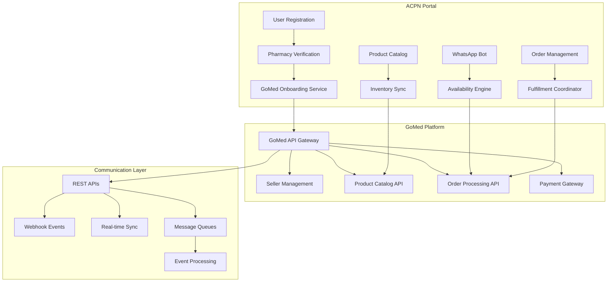

# GoMed Integration Guide

## 🎯 Integration Overview

The GoMed integration represents a strategic partnership that transforms the ACPN Portal into a bridge between traditional pharmacy operations and modern e-commerce platforms. This integration enables seamless product availability queries, automated pharmacist onboarding, and intelligent order fulfillment.

## 🔧 Technical Architecture

### Integration Points



### Authentication & Security

#### API Key Management
```typescript
interface GoMedCredentials {
  apiKey: string           // Primary API key
  clientId: string         // Client identifier
  secretKey: string        // For HMAC signature generation
  environment: 'sandbox' | 'production'
  rateLimit: {
    requestsPerMinute: number
    burstLimit: number
  }
}

class GoMedAuthenticator {
  private credentials: GoMedCredentials
  
  generateSignature(payload: string, timestamp: string): string {
    const message = `${timestamp}.${payload}`
    return crypto
      .createHmac('sha256', this.credentials.secretKey)
      .update(message)
      .digest('hex')
  }
  
  createHeaders(payload: string): Record<string, string> {
    const timestamp = Date.now().toString()
    const signature = this.generateSignature(payload, timestamp)
    
    return {
      'X-API-Key': this.credentials.apiKey,
      'X-Client-ID': this.credentials.clientId,
      'X-Timestamp': timestamp,
      'X-Signature': signature,
      'Content-Type': 'application/json'
    }
  }
}
```

## 🏥 Pharmacist Onboarding Integration

### Automatic Onboarding Process

```typescript
interface OnboardingPayload {
  acpnMemberId: string
  pharmacistData: {
    personalInfo: {
      firstName: string
      lastName: string
      email: string
      phoneNumber: string
      pcnNumber: string
    }
    pharmacyInfo: {
      name: string
      address: PharmacyAddress
      coordinates: GeoCoordinates
      licenseNumber: string
      operatingHours: OperatingSchedule
    }
    businessInfo: {
      cacNumber?: string
      tinNumber?: string
      bankDetails: BankAccount
    }
  }
  membershipTier: 'standard' | 'premium' | 'priority'
  preferences: {
    autoAcceptOrders: boolean
    maxOrderValue: number
    preferredCategories: string[]
    deliveryRadius: number
  }
}

class GoMedOnboardingService {
  async onboardPharmacist(payload: OnboardingPayload): Promise<OnboardingResult> {
    try {
      // Step 1: Validate ACPN membership
      await this.validateACPNMembership(payload.acpnMemberId)
      
      // Step 2: Check for existing GoMed account
      const existingAccount = await this.checkExistingAccount(payload.pharmacistData.personalInfo.email)
      if (existingAccount) {
        return this.handleExistingAccount(existingAccount, payload)
      }
      
      // Step 3: Create GoMed seller account
      const sellerAccount = await this.createSellerAccount(payload)
      
      // Step 4: Setup product catalog integration
      await this.setupCatalogIntegration(sellerAccount.sellerId, payload.acpnMemberId)
      
      // Step 5: Configure WhatsApp integration
      await this.configureWhatsAppIntegration(sellerAccount.sellerId, payload.pharmacistData.personalInfo.phoneNumber)
      
      // Step 6: Set membership tier benefits
      await this.applyMembershipTier(sellerAccount.sellerId, payload.membershipTier)
      
      // Step 7: Send welcome package
      await this.sendWelcomePackage(sellerAccount)
      
      return {
        success: true,
        gomedSellerId: sellerAccount.sellerId,
        credentials: sellerAccount.credentials,
        onboardingStatus: 'completed',
        benefits: this.getTierBenefits(payload.membershipTier)
      }
    } catch (error) {
      logger.error('GoMed onboarding failed', { error, payload })
      throw new OnboardingError(error.message)
    }
  }
  
  private getTierBenefits(tier: string): TierBenefits {
    const benefits = {
      standard: {
        commissionRate: 0.10,           // 10%
        priorityListing: false,
        advancedAnalytics: false,
        dedicatedSupport: false,
        freeMonthlyPromotions: 1
      },
      premium: {
        commissionRate: 0.085,          // 8.5%
        priorityListing: true,
        advancedAnalytics: true,
        dedicatedSupport: true,
        freeMonthlyPromotions: 3
      },
      priority: {
        commissionRate: 0.07,           // 7%
        priorityListing: true,
        advancedAnalytics: true,
        dedicatedSupport: true,
        freeMonthlyPromotions: 5,
        exclusiveCategoriesAccess: true
      }
    }
    
    return benefits[tier] || benefits.standard
  }
}
```

### Onboarding Status Tracking

```typescript
interface OnboardingStatus {
  phase: OnboardingPhase
  completedSteps: OnboardingStep[]
  pendingSteps: OnboardingStep[]
  blockers: OnboardingBlocker[]
  estimatedCompletion: Date
  lastUpdated: Date
}

type OnboardingPhase = 
  | 'initiated'
  | 'documentation_review'
  | 'account_creation'
  | 'integration_setup'
  | 'testing'
  | 'go_live'
  | 'completed'

interface OnboardingStep {
  stepId: string
  name: string
  description: string
  status: 'pending' | 'in_progress' | 'completed' | 'failed'
  completedAt?: Date
  requiredActions?: string[]
}
```

## 📦 Product Catalog Synchronization

### Standardized Catalog Matching

```typescript
interface CatalogMatcher {
  matchProduct(acpnProduct: ACPNProduct): Promise<GoMedProduct | null> {
    const matchingCriteria = [
      this.matchBySKU,
      this.matchByNAFDACNumber,
      this.matchByNameAndManufacturer,
      this.matchByActiveIngredients,
      this.fuzzyMatch
    ]
    
    for (const matcher of matchingCriteria) {
      const match = await matcher(acpnProduct)
      if (match && match.confidence > 0.8) {
        return match.product
      }
    }
    
    // If no match found, create new product request
    return this.createNewProductRequest(acpnProduct)
  }
  
  private async matchBySKU(product: ACPNProduct): Promise<MatchResult> {
    const gomedProduct = await GoMedAPI.findProductBySKU(product.sku)
    return {
      product: gomedProduct,
      confidence: gomedProduct ? 1.0 : 0,
      method: 'sku_exact_match'
    }
  }
  
  private async matchByNAFDACNumber(product: ACPNProduct): Promise<MatchResult> {
    if (!product.nafdacNumber) return { confidence: 0 }
    
    const gomedProduct = await GoMedAPI.findProductByNAFDAC(product.nafdacNumber)
    return {
      product: gomedProduct,
      confidence: gomedProduct ? 0.95 : 0,
      method: 'nafdac_match'
    }
  }
  
  private async fuzzyMatch(product: ACPNProduct): Promise<MatchResult> {
    const searchResults = await GoMedAPI.searchProducts({
      name: product.name,
      manufacturer: product.manufacturer,
      category: product.category
    })
    
    const bestMatch = this.findBestFuzzyMatch(product, searchResults)
    return {
      product: bestMatch?.product,
      confidence: bestMatch?.similarity || 0,
      method: 'fuzzy_match'
    }
  }
}
```

### Real-time Inventory Sync

```typescript
class InventorySyncService {
  async syncInventoryToGoMed(pharmacyId: string, inventoryUpdates: InventoryUpdate[]): Promise<SyncResult> {
    const gomedSellerId = await this.getGoMedSellerId(pharmacyId)
    
    const syncBatch = inventoryUpdates.map(update => ({
      gomedProductId: update.gomedProductId,
      quantity: update.availableQuantity,
      price: update.sellingPrice,
      lastUpdated: update.timestamp,
      location: {
        pharmacyId: pharmacyId,
        coordinates: update.pharmacyCoordinates
      }
    }))
    
    try {
      const result = await GoMedAPI.updateInventory(gomedSellerId, syncBatch)
      
      // Update local sync status
      await this.updateSyncStatus(pharmacyId, {
        lastSync: new Date(),
        syncedItems: result.successful.length,
        failedItems: result.failed.length,
        errors: result.errors
      })
      
      return result
    } catch (error) {
      logger.error('Inventory sync failed', { pharmacyId, error })
      throw new SyncError(`Inventory sync failed: ${error.message}`)
    }
  }
  
  async handleInventoryWebhook(webhook: GoMedInventoryWebhook): Promise<void> {
    const { sellerId, productUpdates, timestamp } = webhook
    
    const pharmacyId = await this.getPharmacyIdFromSellerId(sellerId)
    
    for (const update of productUpdates) {
      await this.updateLocalInventory(pharmacyId, {
        sku: update.sku,
        quantitySold: update.quantityChange,
        gomedOrderId: update.orderId,
        timestamp: timestamp
      })
    }
  }
}
```

## 🛒 Order Processing Integration

### Real-time Availability Queries

```typescript
interface AvailabilityQueryEngine {
  async processGoMedOrder(orderQuery: GoMedOrderQuery): Promise<AvailabilityResponse> {
    const { products, deliveryLocation, urgency, customerId } = orderQuery
    
    // Step 1: Find nearby pharmacies
    const nearbyPharmacies = await this.findNearbyPharmacies(
      deliveryLocation, 
      this.getSearchRadius(urgency)
    )
    
    // Step 2: Filter by product availability
    const pharmaciesWithStock = await this.filterByAvailability(
      nearbyPharmacies, 
      products
    )
    
    // Step 3: Initiate WhatsApp queries for real-time confirmation
    const whatbotQuery = await this.initiateWhatBotQuery({
      queryId: generateQueryId(),
      pharmacies: pharmaciesWithStock,
      products: products,
      urgency: urgency,
      timeout: this.getTimeoutForUrgency(urgency)
    })
    
    // Step 4: Wait for responses and compile results
    const responses = await this.waitForResponses(whatbotQuery.queryId)
    
    // Step 5: Rank and optimize results
    const rankedOptions = await this.rankPharmacyOptions(responses, {
      deliveryLocation,
      customerPreferences: await this.getCustomerPreferences(customerId),
      orderValue: this.calculateOrderValue(products)
    })
    
    return {
      queryId: whatbotQuery.queryId,
      availableOptions: rankedOptions,
      responseTime: Date.now() - orderQuery.timestamp,
      coverage: rankedOptions.length / pharmaciesWithStock.length
    }
  }
  
  private getSearchRadius(urgency: OrderUrgency): number {
    const radiusMap = {
      immediate: 5,      // 5km for immediate delivery
      same_day: 15,      // 15km for same day
      next_day: 25,      // 25km for next day
      flexible: 50       // 50km for flexible delivery
    }
    return radiusMap[urgency] || 15
  }
  
  private async rankPharmacyOptions(
    responses: WhatBotResponse[], 
    context: RankingContext
  ): Promise<RankedPharmacyOption[]> {
    const rankedOptions = responses.map(response => {
      const score = this.calculatePharmacyScore(response, context)
      return {
        pharmacyId: response.pharmacyId,
        gomedSellerId: response.gomedSellerId,
        products: response.availableProducts,
        totalPrice: response.totalPrice,
        deliveryOptions: response.deliveryOptions,
        estimatedDeliveryTime: response.estimatedDeliveryTime,
        score: score,
        ranking: 0  // Will be set after sorting
      }
    })
    
    // Sort by score (descending)
    rankedOptions.sort((a, b) => b.score - a.score)
    
    // Assign rankings
    rankedOptions.forEach((option, index) => {
      option.ranking = index + 1
    })
    
    return rankedOptions
  }
  
  private calculatePharmacyScore(
    response: WhatBotResponse, 
    context: RankingContext
  ): number {
    const weights = {
      price: 0.25,
      distance: 0.20,
      availability: 0.20,
      rating: 0.15,
      responseTime: 0.10,
      deliveryTime: 0.10
    }
    
    const scores = {
      price: this.scorePricing(response.totalPrice, context.orderValue),
      distance: this.scoreDistance(response.distance, context.deliveryLocation),
      availability: this.scoreAvailability(response.availableProducts, context.requestedProducts),
      rating: this.scoreRating(response.pharmacyRating),
      responseTime: this.scoreResponseTime(response.responseTime),
      deliveryTime: this.scoreDeliveryTime(response.estimatedDeliveryTime)
    }
    
    return Object.entries(weights).reduce((total, [factor, weight]) => {
      return total + (scores[factor] * weight)
    }, 0)
  }
}
```

### Order Fulfillment Coordination

```typescript
class OrderFulfillmentCoordinator {
  async processGoMedOrder(order: GoMedOrder): Promise<FulfillmentResult> {
    const fulfillmentPlan = await this.createFulfillmentPlan(order)
    
    try {
      // Step 1: Reserve inventory
      await this.reserveInventory(fulfillmentPlan)
      
      // Step 2: Notify selected pharmacy
      await this.notifyPharmacy(fulfillmentPlan)
      
      // Step 3: Confirm with GoMed
      await this.confirmOrderWithGoMed(order.gomedOrderId, fulfillmentPlan)
      
      // Step 4: Setup delivery coordination
      const delivery = await this.setupDelivery(fulfillmentPlan)
      
      // Step 5: Initialize tracking
      await this.initializeTracking(order.gomedOrderId, delivery.trackingId)
      
      return {
        success: true,
        fulfillmentId: fulfillmentPlan.id,
        trackingId: delivery.trackingId,
        estimatedDelivery: delivery.estimatedArrival,
        pharmacy: fulfillmentPlan.selectedPharmacy
      }
    } catch (error) {
      // Rollback reservations
      await this.rollbackReservations(fulfillmentPlan)
      throw new FulfillmentError(`Order fulfillment failed: ${error.message}`)
    }
  }
  
  async handleOrderStatusUpdate(update: OrderStatusUpdate): Promise<void> {
    const { orderId, status, metadata } = update
    
    // Update internal tracking
    await this.updateInternalStatus(orderId, status, metadata)
    
    // Notify GoMed of status change
    await this.notifyGoMedStatusChange(orderId, status, metadata)
    
    // Handle status-specific logic
    switch (status) {
      case 'preparing':
        await this.startPreparationTimer(orderId)
        break
      case 'ready_for_pickup':
        await this.notifyDeliveryService(orderId)
        break
      case 'out_for_delivery':
        await this.startDeliveryTracking(orderId)
        break
      case 'delivered':
        await this.finalizeOrder(orderId)
        break
      case 'cancelled':
        await this.handleCancellation(orderId, metadata.reason)
        break
    }
  }
}
```

## 📊 Analytics & Intelligence Sharing

### Market Intelligence Pipeline

```typescript
interface MarketIntelligencePipeline {
  async generateMarketInsights(): Promise<MarketInsights> {
    const insights = {
      demandAnalysis: await this.analyzeDemandPatterns(),
      priceIntelligence: await this.analyzePricingTrends(),
      gapAnalysis: await this.identifySupplyGaps(),
      seasonalTrends: await this.analyzeSeasonalPatterns(),
      geographicInsights: await this.analyzeGeographicDemand()
    }
    
    // Share relevant insights with GoMed
    await this.shareInsightsWithGoMed(insights)
    
    return insights
  }
  
  private async analyzeDemandPatterns(): Promise<DemandAnalysis> {
    const requestData = await this.getMarketplaceRequestData()
    const gomedOrderData = await this.getGoMedOrderData()
    
    return {
      topRequestedProducts: this.identifyTopProducts(requestData),
      emergingTrends: this.identifyTrends(requestData, gomedOrderData),
      unsatisfiedDemand: this.identifyGaps(requestData),
      demandForecasts: await this.forecastDemand(requestData)
    }
  }
  
  private async shareInsightsWithGoMed(insights: MarketInsights): Promise<void> {
    const filteredInsights = this.filterSensitiveData(insights)
    
    await GoMedAPI.shareMarketIntelligence({
      insights: filteredInsights,
      generatedAt: new Date(),
      validUntil: addDays(new Date(), 7),
      confidence: this.calculateConfidenceScore(insights)
    })
  }
}
```

## 🚨 Error Handling & Monitoring

### Resilience Patterns

```typescript
class GoMedIntegrationService {
  private circuitBreaker: CircuitBreaker
  private retryPolicy: ExponentialBackoff
  
  constructor() {
    this.circuitBreaker = new CircuitBreaker({
      errorThresholdPercentage: 50,
      requestVolumeThreshold: 20,
      sleepWindowInMilliseconds: 60000
    })
    
    this.retryPolicy = new ExponentialBackoff({
      maxRetries: 3,
      baseDelay: 1000,
      maxDelay: 10000,
      jitter: true
    })
  }
  
  async callGoMedAPI<T>(operation: () => Promise<T>): Promise<T> {
    return this.circuitBreaker.execute(async () => {
      return this.retryPolicy.execute(operation)
    })
  }
  
  async handleAPIFailure(error: GoMedAPIError): Promise<void> {
    logger.error('GoMed API failure', { error })
    
    // Emit metric for monitoring
    metrics.increment('gomed.api.errors', {
      error_type: error.type,
      endpoint: error.endpoint
    })
    
    // Handle specific error types
    switch (error.type) {
      case 'rate_limit_exceeded':
        await this.handleRateLimit(error)
        break
      case 'authentication_failed':
        await this.refreshAuthentication()
        break
      case 'service_unavailable':
        await this.enableFallbackMode()
        break
      default:
        await this.notifyOperationsTeam(error)
    }
  }
  
  private async enableFallbackMode(): Promise<void> {
    // Switch to local processing for non-critical operations
    await this.enableLocalProcessing()
    
    // Notify stakeholders
    await this.notifyStakeholders('GoMed integration temporarily unavailable')
    
    // Setup automated recovery check
    this.scheduleRecoveryCheck()
  }
}
```

### Monitoring & Alerting

```typescript
interface IntegrationMetrics {
  performance: {
    apiResponseTime: Histogram
    orderProcessingTime: Histogram
    inventorySyncTime: Histogram
    errorRate: Gauge
  }
  
  business: {
    onboardedPharmacies: Counter
    processedOrders: Counter
    syncedProducts: Counter
    revenue: Gauge
  }
  
  reliability: {
    uptime: Gauge
    circuitBreakerTrips: Counter
    retryAttempts: Counter
    fallbackActivations: Counter
  }
}

class IntegrationMonitor {
  async checkIntegrationHealth(): Promise<HealthStatus> {
    const checks = await Promise.all([
      this.checkGoMedConnectivity(),
      this.checkDatabaseConnectivity(),
      this.checkQueueHealth(),
      this.checkCacheAvailability()
    ])
    
    const overallHealth = checks.every(check => check.healthy) ? 'healthy' : 'degraded'
    
    if (overallHealth === 'degraded') {
      await this.triggerAlert('Integration health degraded', checks)
    }
    
    return {
      status: overallHealth,
      checks: checks,
      timestamp: new Date()
    }
  }
}
```

This comprehensive GoMed integration guide provides all the technical details needed to implement and maintain the integration between ACPN Portal and GoMed platform, ensuring reliable operation and optimal business outcomes. 