# System Architecture Overview

> **Copyright © 2024 TechJamLabs**  
> Website: [www.techjamlabs.com](https://www.techjamlabs.com)  
> Phone: +234 201 330 9089 | +1 206 710 0170  
> **Authors:** Ben Adenle, Odinaka Solomon, Dare Oloruntoba

> **ACPN Lagos Portal - Comprehensive Digital Ecosystem Architecture**
> 
> A scalable, open-source VPS-based platform designed for pharmaceutical practice management, continuing professional development, and digital transformation.

---

## 🏗️ **Comprehensive System Architecture**

### **High-Level System Architecture**

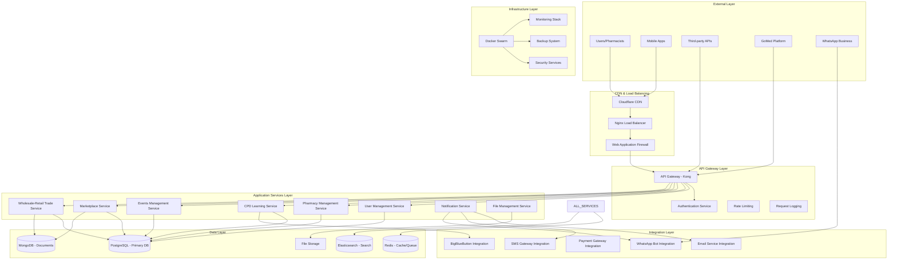

### **Microservices Architecture Detail**

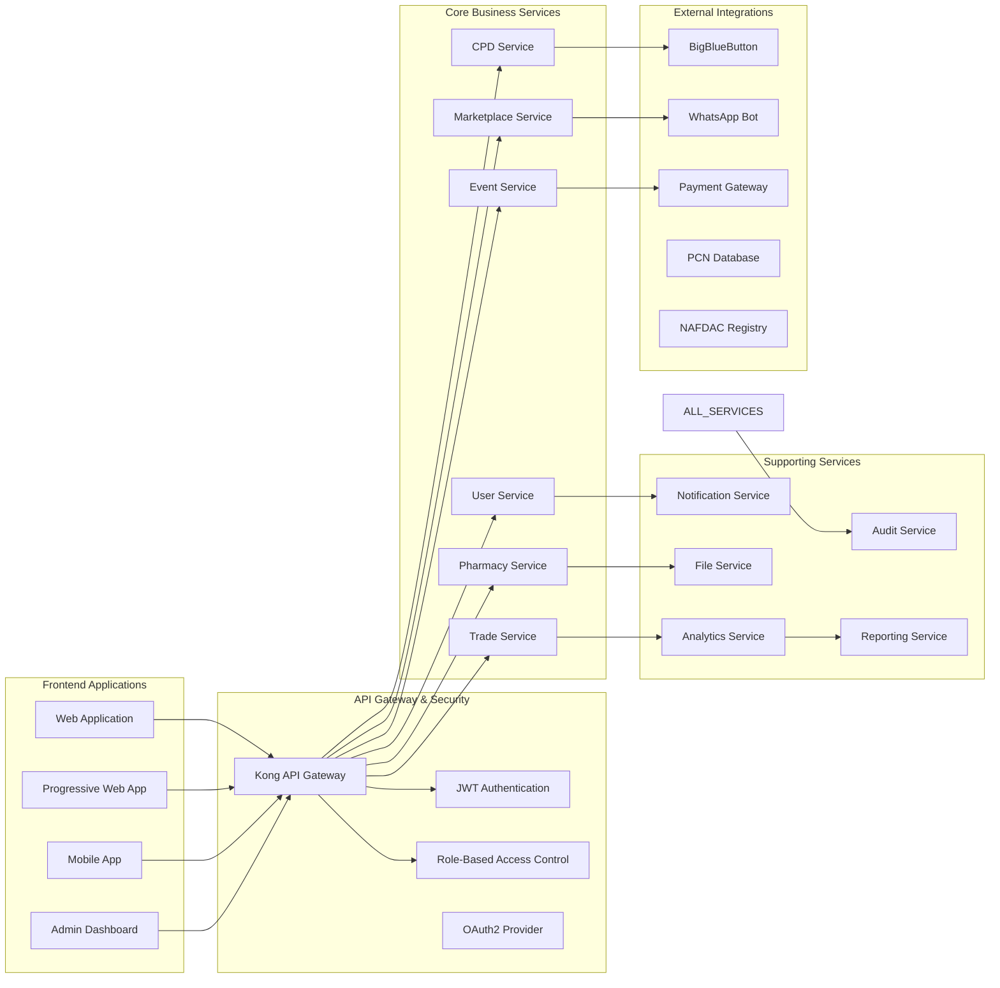

---

## 🏗️ **Architectural Philosophy**

### **Design Principles**
- **Scalability First**: Horizontal scaling capabilities using containerized microservices
- **Open Source Foundation**: Built entirely on open-source technologies for cost-effectiveness and flexibility
- **VPS-Optimized**: Designed for Virtual Private Server deployment with resource efficiency
- **Modular Architecture**: Loosely coupled services enabling independent scaling and maintenance
- **Security by Design**: Multi-layered security approach with role-based access control
- **Performance Optimized**: Caching strategies and optimized data flows for responsive user experience

### **Core Architectural Patterns**
- **Microservices Architecture**: Independent, deployable services
- **Event-Driven Communication**: Asynchronous messaging between services
- **API-First Design**: RESTful APIs with GraphQL for complex queries
- **Domain-Driven Design**: Business logic organized around pharmaceutical domains
- **CQRS Pattern**: Command Query Responsibility Segregation for optimal performance

---

## 🗄️ **Data Architecture & Database Design**

### **Database Architecture Overview**

```mermaid
graph TB
    subgraph "Application Layer"
        APP1[User Management App]
        APP2[Pharmacy Management App]
        APP3[CPD Learning App]
        APP4[Events Management App]
        APP5[Marketplace App]
        APP6[Trade Management App]
    end
    
    subgraph "Data Access Layer"
        ORM[TypeORM/Prisma]
        CACHE[Redis Cache Layer]
        QUEUE[Redis Queue]
        SEARCH[Elasticsearch]
    end
    
    subgraph "Primary Database - PostgreSQL"
        PG_USERS[(Users & Authentication)]
        PG_PHARMACY[(Pharmacy Data)]
        PG_CPD[(CPD Records)]
        PG_EVENTS[(Events & Registrations)]
        PG_TRANSACTIONS[(Financial Transactions)]
        PG_AUDIT[(Audit Logs)]
    end
    
    subgraph "Document Database - MongoDB"
        MONGO_PRODUCTS[(Product Catalogs)]
        MONGO_CONTENT[(Learning Content)]
        MONGO_LOGS[(Activity Logs)]
        MONGO_ANALYTICS[(Analytics Data)]
    end
    
    subgraph "File Storage"
        FS_DOCS[Documents]
        FS_MEDIA[Media Files]
        FS_CERTS[Certificates]
        FS_BACKUP[Backup Files]
    end
    
    APP1 --> ORM
    APP2 --> ORM
    APP3 --> ORM
    APP4 --> ORM
    APP5 --> ORM
    APP6 --> ORM
    
    ORM --> CACHE
    ORM --> PG_USERS
    ORM --> PG_PHARMACY
    ORM --> PG_CPD
    ORM --> PG_EVENTS
    ORM --> PG_TRANSACTIONS
    ORM --> PG_AUDIT
    
    ORM --> MONGO_PRODUCTS
    ORM --> MONGO_CONTENT
    ORM --> MONGO_LOGS
    ORM --> MONGO_ANALYTICS
    
    APP1 --> FS_DOCS
    APP3 --> FS_MEDIA
    APP4 --> FS_CERTS
    QUEUE --> FS_BACKUP
    
    SEARCH --> PG_USERS
    SEARCH --> MONGO_PRODUCTS
    SEARCH --> MONGO_CONTENT
```

### **Core Data Relationships**

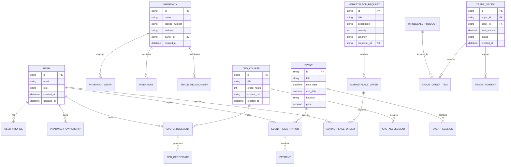

---

## 🔒 **Security Architecture**

### **Multi-Layer Security Model**

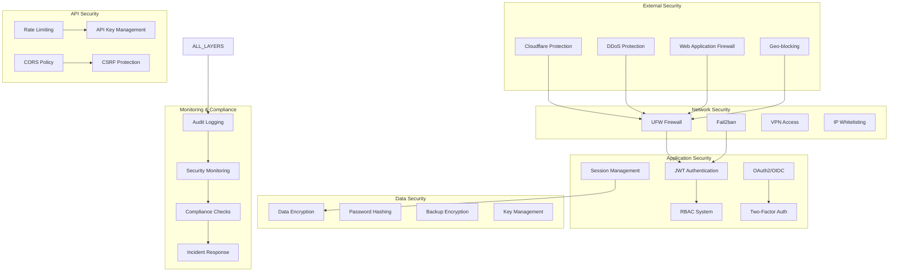

### **Authentication & Authorization Flow**

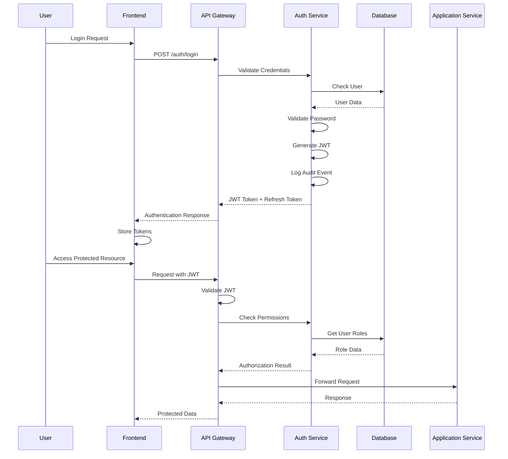

---

## 🔗 **Integration Architecture**

### **External Integrations Overview**

```mermaid
graph TB
    subgraph "ACPN Portal Core"
        CORE[Core Application]
        API_GW[API Gateway]
        WEBHOOK[Webhook Handler]
        QUEUE[Message Queue]
    end
    
    subgraph "Learning & CPD Integrations"
        BBB[BigBlueButton Server]
        SCORM[SCORM Player]
        CERT[Certificate Generator]
        PCN_API[PCN Database API]
    end
    
    subgraph "Communication Integrations"
        WHATSAPP[WhatsApp Business API]
        EMAIL_SVC[Email Service - SendGrid]
        SMS_SVC[SMS Gateway]
        PUSH[Push Notification Service]
    end
    
    subgraph "Financial Integrations"
        PAYSTACK[Paystack Payment]
        FLUTTERWAVE[Flutterwave Payment]
        BANK_API[Bank APIs]
        INVOICE[Invoice Generator]
    end
    
    subgraph "Marketplace Integrations"
        GOMED[GoMed Platform]
        NAFDAC[NAFDAC Registry]
        CUSTOMS[Nigeria Customs]
        LOGISTICS[Logistics Partners]
    end
    
    subgraph "Monitoring & Analytics"
        PROMETHEUS[Prometheus]
        GRAFANA[Grafana]
        ELK[ELK Stack]
        SENTRY[Sentry Error Tracking]
    end
    
    CORE --> API_GW
    API_GW --> BBB
    API_GW --> WHATSAPP
    API_GW --> PAYSTACK
    API_GW --> GOMED
    
    WEBHOOK --> QUEUE
    QUEUE --> CORE
    
    CORE --> PCN_API
    CORE --> EMAIL_SVC
    CORE --> SMS_SVC
    CORE --> NAFDAC
    
    PROMETHEUS --> GRAFANA
    CORE --> ELK
    CORE --> SENTRY
```

### **WhatsApp Bot Integration Flow**

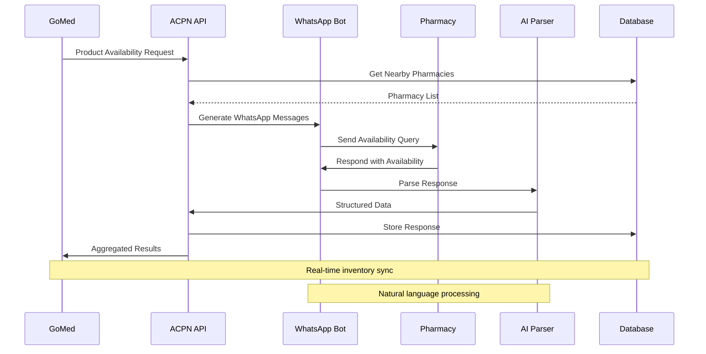

---

## 🖥️ **VPS Infrastructure Architecture**

### **Server Configuration**
```yaml
Primary VPS Configuration:
  CPU: 8 cores (scalable to 16 cores)
  RAM: 32GB (scalable to 64GB)
  Storage: 500GB SSD (expandable with block storage)
  Network: 1Gbps dedicated bandwidth
  OS: Ubuntu Server 22.04 LTS
  
Load Balancer VPS:
  CPU: 4 cores
  RAM: 8GB
  Network: Load balancing across multiple application servers
  
Database VPS (separate for security):
  CPU: 8 cores
  RAM: 32GB
  Storage: 1TB SSD with automated backups
```

### **Infrastructure Deployment Architecture**

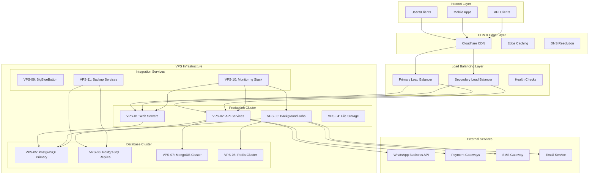

### **Container Orchestration Architecture**

```mermaid
graph TB
    subgraph "Docker Swarm Cluster"
        subgraph "Manager Nodes"
            MGR1[Manager-01]
            MGR2[Manager-02]
            MGR3[Manager-03]
        end
        
        subgraph "Worker Nodes"
            WORK1[Worker-01]
            WORK2[Worker-02]
            WORK3[Worker-03]
            WORK4[Worker-04]
            WORK5[Worker-05]
        end
        
        subgraph "Service Stack"
            WEB_SVC[Web Service Stack]
            API_SVC[API Service Stack]
            BG_SVC[Background Service Stack]
            DB_SVC[Database Service Stack]
        end
        
        subgraph "Storage & Networking"
            OVERLAY[Overlay Network]
            VOLUMES[Docker Volumes]
            SECRETS[Docker Secrets]
            CONFIGS[Docker Configs]
        end
    end
    
    subgraph "Service Discovery"
        CONSUL[Consul Service Discovery]
        DNS_SD[DNS Service Discovery]
        LOAD_BAL[Internal Load Balancing]
    end
    
    subgraph "Monitoring & Logging"
        PROMETHEUS[Prometheus]
        GRAFANA[Grafana]
        LOKI[Loki Logging]
        ALERTMANAGER[Alert Manager]
    end
    
    MGR1 --> WORK1
    MGR1 --> WORK2
    MGR2 --> WORK3
    MGR2 --> WORK4
    MGR3 --> WORK5
    
    WEB_SVC --> WORK1
    API_SVC --> WORK2
    API_SVC --> WORK3
    BG_SVC --> WORK4
    DB_SVC --> WORK5
    
    ALL_SERVICES --> OVERLAY
    ALL_SERVICES --> VOLUMES
    ALL_SERVICES --> SECRETS
    
    CONSUL --> DNS_SD
    DNS_SD --> LOAD_BAL
    
    PROMETHEUS --> GRAFANA
    LOKI --> GRAFANA
    PROMETHEUS --> ALERTMANAGER
```

### **Service Mesh & Communication**

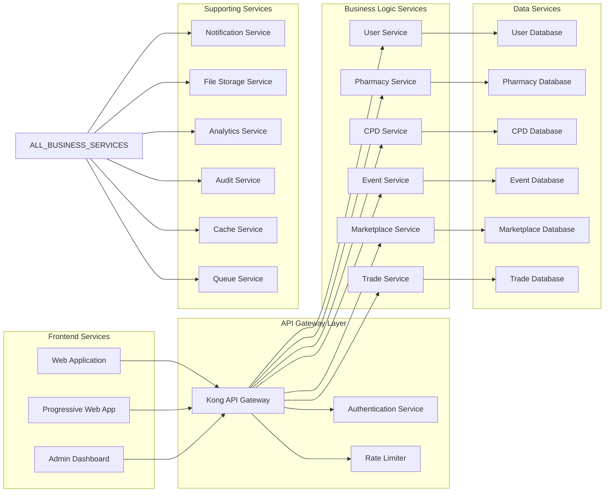

### **Network Architecture**
```
Internet Layer
    ↓
[Cloudflare CDN] → [Edge Caching] → [DDoS Protection]
    ↓                        ↓                ↓
[DNS Resolution]     [WAF Filtering]   [Geo-blocking]
    ↓                        ↓                ↓
Load Balancer Layer
    ↓
[Primary LB (Nginx)] ↔ [Secondary LB (HAProxy)]
    ↓                        ↓
[Health Checks]      [SSL Termination]
    ↓                        ↓
Application Layer
    ↓
[Docker Swarm Cluster] → [Service Discovery] → [Internal Load Balancing]
    ↓                        ↓                        ↓
[Web Services]       [API Services]           [Background Services]
    ↓                        ↓                        ↓
Data Layer
    ↓
[PostgreSQL Cluster] + [MongoDB Cluster] + [Redis Cluster] + [File Storage]
    ↓                        ↓                   ↓              ↓
[Primary DB]         [Document Store]    [Cache/Queue]   [Media Files]
[Replica DB]         [Analytics Data]    [Sessions]      [Documents]
```

---

## 🔧 **Technology Stack**

### **Core Infrastructure**
```yaml
Operating System: Ubuntu Server 22.04 LTS
Containerization: Docker CE + Docker Swarm
Web Server: Nginx (reverse proxy + load balancer)
SSL/TLS: Let's Encrypt with automated renewal
Firewall: UFW (Uncomplicated Firewall) + fail2ban
Process Management: systemd + PM2 for Node.js
```

### **Application Layer**
```yaml
Backend Runtime: Node.js 20 LTS
Framework: Express.js with TypeScript
API Gateway: Kong Community Edition
Authentication: JWT + Passport.js
Session Management: Redis-based sessions
File Uploads: Multer with local storage + backup
```

### **Database Layer**
```yaml
Primary Database: PostgreSQL 15 (user data, transactions)
Document Store: MongoDB 7.0 (content, publications)
Cache Layer: Redis 7.0 (session, cache, job queue)
Search Engine: Elasticsearch 8.0 (full-text search)
Queue System: Redis Bull (background jobs)
```

### **Frontend Stack**
```yaml
Framework: Next.js 15 with React 19
Language: TypeScript
Styling: Tailwind CSS 4
State Management: Zustand + React Query
PWA: Next.js PWA with offline support
Build Tool: Turbopack
```

---

## 🎓 **CPD & Learning Management Architecture**

### **BigBlueButton Integration**
```yaml
BBB Server Configuration:
  Version: BigBlueButton 2.7
  Installation: Dedicated VPS instance
  CPU: 8 cores (minimum)
  RAM: 16GB (recommended 32GB)
  Network: High bandwidth for video streaming
  
Integration Components:
  BBB API: RESTful API integration
  Recording Processing: Automated post-session processing
  Content Delivery: Nginx for recorded session delivery
  Authentication: ACPN portal SSO integration
```

### **Learning Platform Components**
```yaml
Course Management Service:
  Purpose: Course creation, management, and delivery
  Database: PostgreSQL for structured course data
  Files: Local storage for course materials
  Features: SCORM compliance, progress tracking
  
Assessment Engine:
  Purpose: Quizzes, assignments, and evaluations
  Database: PostgreSQL for assessment data
  Features: Automated grading, certificate generation
  Integration: CPD credit calculation and tracking
  
Content Delivery Network:
  Purpose: Fast delivery of learning materials
  Technology: Nginx with caching
  Features: Video streaming, document delivery
  Optimization: Gzip compression, browser caching
```

### **CPD Credit System**
```yaml
Credit Tracking Service:
  Database: PostgreSQL for credit records
  Features: Automatic credit calculation
  Compliance: PCN requirements integration
  Reporting: Individual and aggregate analytics
  
Certificate Generation:
  Technology: PDFKit for dynamic certificates
  Storage: Local file system with backups
  Features: Digital signatures, verification codes
  Integration: Email delivery system
```

---

## 🏪 **Multi-Store Management Architecture**

### **Store Hierarchy System**
```yaml
Ownership Model:
  Primary Pharmacist: Can own multiple stores
  Resident Pharmacist: Assigned to specific store
  Staff Members: Store-specific access only
  
Store Registration:
  GPS Verification: Geolocation validation
  PCN Integration: Pharmacist license verification
  Document Management: Store permits and certificates
  Compliance Tracking: Regulatory requirement monitoring
```

### **Multi-Store Data Architecture**
```yaml
Database Design:
  Users Table: Global user accounts
  Pharmacies Table: Individual store records
  Store_Pharmacists: Many-to-many relationship
  Store_Staff: Store-specific staff assignments
  Inventory: Store-specific product tracking
  
Access Control:
  Role-Based: Different permissions per store
  Data Isolation: Store-specific data access
  Cross-Store: Owner-level aggregated views
  Audit Trail: All store operations logged
```

### **Inventory Management**
```yaml
Store-Level Inventory:
  Real-time stock tracking per store
  Automated reorder notifications
  Cross-store transfer capabilities
  Centralized procurement options
  
Integration Points:
  GoMed Sync: Store-specific product availability
  WhatsApp Bot: Store inventory queries
  Analytics: Cross-store performance comparison
  Compliance: Controlled substance tracking
```

---

## 🔌 **Integration Architecture**

### **GoMed Platform Integration**
```yaml
Integration Type: RESTful API
Authentication: OAuth 2.0 + API keys
Data Sync: Real-time inventory synchronization
Store Mapping: Each ACPN store → GoMed seller account
Order Flow: ACPN → GoMed → Customer fulfillment

Publication Sharing:
  Permission System: ACPN super admin controlled
  Content Types: Guidelines, regulations, updates
  Access Control: Role-based GoMed user access
  Sync Frequency: Real-time for critical updates
```

### **WhatsApp Bot (WhatBot) Architecture**
```yaml
Bot Framework: Venom-bot (open source)
Message Queue: Redis Bull for message processing
Business Logic: Separate microservice
Database: MongoDB for conversation logs
Response Engine: AI-powered query understanding

Features:
  Product Availability: Real-time store inventory
  CPD Content: Daily educational content delivery
  Order Updates: Purchase confirmation and tracking
  Emergency Alerts: Critical regulatory notifications
```

### **BigBlueButton Integration Flow**
```yaml
Session Management:
  Create Session: ACPN portal → BBB API
  User Authentication: SSO token validation
  Join Session: Direct BBB room access
  Recording: Automated post-session processing
  
Content Pipeline:
  Live Session → Recording → Processing → CDN → Portal
  Metadata: Session details, attendance, analytics
  Integration: CPD credit automatic assignment
```

---

## 🔐 **Security Architecture**

### **Multi-Layer Security**
```yaml
Network Security:
  Firewall: UFW with strict ingress rules
  DDoS Protection: Cloudflare + rate limiting
  VPN Access: WireGuard for admin access
  SSL/TLS: Let's Encrypt with HSTS headers
  
Application Security:
  Authentication: JWT with refresh tokens
  Authorization: RBAC with store-level permissions
  Input Validation: Joi schema validation
  SQL Injection: Parameterized queries only
  XSS Protection: Content Security Policy headers
  
Data Security:
  Encryption at Rest: PostgreSQL + MongoDB encryption
  Encryption in Transit: TLS 1.3 minimum
  Sensitive Data: Environment variables + Docker secrets
  Audit Logging: All sensitive operations logged
```

### **Backup & Recovery**
```yaml
Database Backups:
  Frequency: Daily automated backups
  Retention: 30 days local, 90 days off-site
  Testing: Monthly restore verification
  Recovery Time: < 4 hours for full restore
  
File System Backups:
  User Uploads: Real-time replication
  Application Code: Git-based version control
  Configuration: Infrastructure as code
  
Disaster Recovery:
  RTO (Recovery Time Objective): 4 hours
  RPO (Recovery Point Objective): 1 hour
  Failover: Automated secondary VPS activation
```

---

## 📊 **Data Flow Architecture**

### **Core Data Flows**

#### **User Registration & Multi-Store Setup**
```
User Registration → PCN Verification → Store Registration 
→ GPS Verification → Resident Pharmacist Assignment 
→ GoMed Account Creation → WhatsApp Bot Setup
```

#### **CPD Learning Flow**
```
Course Enrollment → BigBlueButton Session Creation 
→ Live Learning/Recording → Assessment Completion 
→ CPD Credit Assignment → Certificate Generation 
→ WhatsApp Notification
```

#### **Marketplace Order Flow**
```
Customer Order (GoMed) → WhatsApp Product Query 
→ Store Inventory Check → Availability Response 
→ Order Confirmation → Fulfillment Tracking 
→ Completion Notification
```

#### **Publication Distribution**
```
Content Creation → ACPN Admin Approval 
→ Permission Tagging → WhatsApp Distribution 
→ GoMed Sharing (if permitted) → Engagement Analytics
```

### **Real-Time Data Synchronization**
```yaml
Inventory Sync:
  ACPN Store Updates → GoMed Platform
  Frequency: Real-time via webhooks
  Conflict Resolution: Last-write-wins with audit trail
  
CPD Progress:
  Learning Activity → Real-time Progress Update
  Credit Calculation → Automatic Transcript Update
  Certificate Generation → Immediate Availability
  
WhatsApp Interactions:
  Query Reception → Context Analysis → Database Lookup
  Response Generation → Delivery Confirmation → Analytics
```

---

## 🚀 **Scalability Design**

### **Horizontal Scaling Strategy**
```yaml
Application Scaling:
  Load Balancer: Nginx with round-robin
  App Servers: Docker Swarm auto-scaling
  Database: Read replicas for query optimization
  Cache: Redis cluster for distributed caching
  
BigBlueButton Scaling:
  Multiple BBB Instances: Load-balanced across servers
  Recording Processing: Distributed across worker nodes
  Content Delivery: CDN for optimized media delivery
  
WhatsApp Bot Scaling:
  Message Queue: Redis Bull with multiple workers
  Conversation State: Distributed across Redis cluster
  Response Generation: Parallel processing workers
```

### **Performance Optimization**
```yaml
Database Optimization:
  Indexing: Strategic index placement
  Query Optimization: Explain plan analysis
  Connection Pooling: PgBouncer for PostgreSQL
  Partitioning: Time-based table partitioning
  
Caching Strategy:
  Redis: Session, frequently accessed data
  Nginx: Static content caching
  Application: In-memory caching for hot paths
  CDN: Global content distribution
  
Resource Management:
  CPU: Auto-scaling based on utilization
  Memory: Optimized container resource limits
  Storage: Automated cleanup and archival
  Network: Bandwidth monitoring and optimization
```

---

## 🔄 **Monitoring & Observability**

### **System Monitoring**
```yaml
Infrastructure Monitoring:
  Tool: Prometheus + Grafana
  Metrics: CPU, memory, disk, network
  Alerts: Slack/email for critical issues
  Dashboards: Real-time system status
  
Application Monitoring:
  APM: Custom metrics collection
  Error Tracking: Centralized error logging
  Performance: Response time monitoring
  User Analytics: Feature usage tracking
  
Database Monitoring:
  PostgreSQL: pg_stat_statements analysis
  MongoDB: Performance profiling
  Redis: Memory usage and hit rates
  Elasticsearch: Cluster health monitoring
```

### **Logging Strategy**
```yaml
Centralized Logging:
  Tool: ELK Stack (Elasticsearch, Logstash, Kibana)
  Application Logs: Structured JSON logging
  Access Logs: Nginx request logging
  Security Logs: Authentication and authorization events
  Audit Logs: All sensitive operations
  
Log Management:
  Retention: 90 days for application logs
  Security Logs: 1 year retention
  Rotation: Daily log rotation
  Compression: Gzip compression for archived logs
```

---

## 🔄 **Development & Deployment Workflow**

### **CI/CD Pipeline**
```yaml
Source Control: Git with feature branching
CI/CD Tool: GitHub Actions (free tier)
Testing: Automated unit, integration, and e2e tests
Building: Docker image creation and registry push
Deployment: Rolling updates via Docker Swarm
Rollback: Automatic rollback on deployment failure
```

### **Environment Management**
```yaml
Development: Local Docker Compose environment
Staging: Scaled-down production replica
Production: Full VPS cluster deployment
Configuration: Environment-specific Docker secrets
Database: Separate database instances per environment
```

---

## 📈 **Future Scalability Considerations**

### **Growth Planning**
```yaml
User Scaling:
  Target: 10,000+ registered pharmacists
  Stores: 5,000+ pharmacy locations
  Concurrent Users: 1,000+ simultaneous
  
Content Scaling:
  Courses: 1,000+ CPD courses
  Publications: 10,000+ documents
  Videos: Terabytes of recorded content
  
Geographic Scaling:
  Multi-State: Additional state chapters
  International: West African expansion
  Compliance: Multi-jurisdiction regulatory support
```

### **Technology Evolution**
```yaml
Microservices Evolution:
  Current: Monolithic with service separation
  Future: Full microservices architecture
  Communication: Event-driven architecture
  
Container Orchestration:
  Current: Docker Swarm
  Future: Kubernetes migration option
  Cloud: Multi-cloud deployment capability
  
Performance Enhancement:
  Caching: Advanced caching strategies
  Database: Sharding for massive scale
  CDN: Global content delivery optimization
```

---

This architecture provides a robust, scalable foundation for the ACPN Lagos Portal, supporting all current requirements while maintaining flexibility for future growth and enhancement.