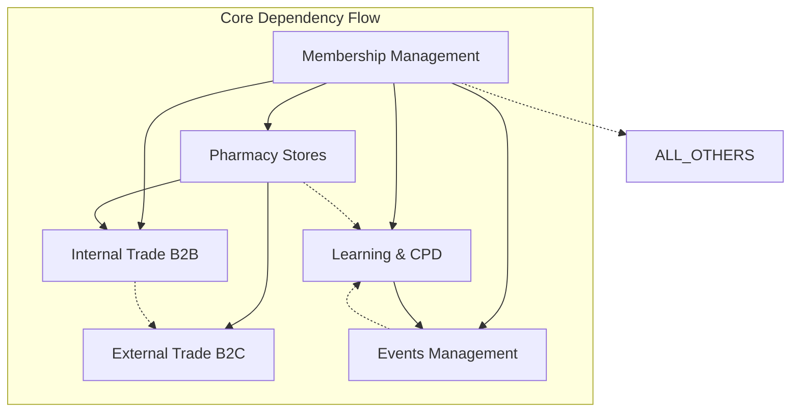

# ACPN Lagos Portal - System Overview

> **Copyright © 2024 TechJamLabs**  
> Website: [www.techjamlabs.com](https://www.techjamlabs.com)  
> Phone: +234 201 330 9089 | +1 206 710 0170  
> **Authors:** Ben Adenle, Odinaka Solomon, Dare Oloruntoba

---

## 🌟 **Executive Summary**

The **ACPN Lagos Portal** is a comprehensive digital ecosystem that revolutionizes pharmaceutical practice management in Lagos State, Nigeria. Built by **TechJamLabs**, this innovative platform integrates six core applications to provide end-to-end solutions for pharmacists, pharmacy stores, professional development, trade operations, and event management.

---

## 🎯 **Vision & Mission**

### **Vision**
To become the leading digital platform for pharmaceutical professionals in West Africa, setting the standard for professional practice management, continuing education, and business operations.

### **Mission**
To empower pharmacists with cutting-edge technology solutions that enhance professional development, streamline business operations, ensure regulatory compliance, and foster community engagement while maintaining the highest standards of pharmaceutical care.

---

## 🏗️ **Platform Architecture**

### **Complete System Overview**

```mermaid
graph TB
    subgraph "External Users & Interfaces"
        MEMBERS[ACPN Members]
        PHARMACISTS[Pharmacists]
        CUSTOMERS[End Customers]
        ADMINS[System Administrators]
        EXTERNAL[External Partners]
    end
    
    subgraph "Core Applications Layer"
        APP1[1. Membership Management]
        APP2[2. Pharmacy Stores Management]
        APP3[3. Learning & CPD]
        APP4[4. Internal Trade B2B]
        APP5[5. External Trade B2C]
        APP6[6. Events Management]
    end
    
    subgraph "Shared Services Layer"
        AUTH[Authentication & Authorization]
        NOTIFICATION[Notification Services]
        PAYMENT[Payment Processing]
        ANALYTICS[Analytics & Reporting]
        FILE_MGMT[File Management]
        AUDIT[Audit & Compliance]
    end
    
    subgraph "Integration Layer"
        PCN_INT[PCN Database Integration]
        NAFDAC_INT[NAFDAC Registry]
        GOMED_INT[GoMed Platform]
        WHATSAPP_INT[WhatsApp Bot]
        BBB_INT[BigBlueButton]
        PAYMENT_GW[Payment Gateways]
    end
    
    subgraph "Data Layer"
        POSTGRES[(PostgreSQL - Primary)]
        MONGODB[(MongoDB - Documents)]
        REDIS[(Redis - Cache/Queue)]
        ELASTICSEARCH[(Elasticsearch - Search)]
        FILE_STORAGE[File Storage System]
    end
    
    subgraph "Infrastructure Layer"
        DOCKER[Docker Swarm]
        NGINX[Load Balancer]
        MONITORING[Monitoring Stack]
        BACKUP[Backup Systems]
        SECURITY[Security Services]
    end
    
    %% User Interactions
    MEMBERS --> APP1
    PHARMACISTS --> APP2
    PHARMACISTS --> APP3
    PHARMACISTS --> APP4
    CUSTOMERS --> APP5
    MEMBERS --> APP6
    ADMINS --> ALL_APPS
    
    %% Application Dependencies
    APP1 --> AUTH
    APP2 --> APP1
    APP3 --> APP1
    APP4 --> APP1
    APP4 --> APP2
    APP5 --> APP2
    APP6 --> APP1
    APP6 --> APP3
    
    %% Shared Services
    ALL_APPS --> NOTIFICATION
    ALL_APPS --> PAYMENT
    ALL_APPS --> ANALYTICS
    ALL_APPS --> FILE_MGMT
    ALL_APPS --> AUDIT
    
    %% External Integrations
    APP1 --> PCN_INT
    APP2 --> NAFDAC_INT
    APP3 --> BBB_INT
    APP4 --> PAYMENT_GW
    APP5 --> GOMED_INT
    APP5 --> WHATSAPP_INT
    APP6 --> PAYMENT_GW
    
    %% Data Access
    ALL_APPS --> POSTGRES
    ALL_APPS --> MONGODB
    ALL_APPS --> REDIS
    ALL_APPS --> ELASTICSEARCH
    ALL_APPS --> FILE_STORAGE
    
    %% Infrastructure
    ALL_COMPONENTS --> DOCKER
    ALL_COMPONENTS --> NGINX
    ALL_COMPONENTS --> MONITORING
    ALL_COMPONENTS --> BACKUP
    ALL_COMPONENTS --> SECURITY
```

---

## 📱 **The Six Core Applications**

### **1. 👥 Membership Management Application**
Foundation application managing all member-related operations including user registration, PCN verification, profile management, role-based access control, membership tiers, dues processing, and member analytics.

### **2. 🏪 Pharmacy Stores Management Application**
Comprehensive pharmacy operations management with multi-store registration, inventory tracking, staff management, compliance monitoring, store analytics, and regulatory requirement tracking.

### **3. 🎓 Learning & CPD Application**
Professional development platform featuring course management, virtual classroom integration, assessment and certification, CPD credit tracking, learning paths, and progress monitoring.

### **4. 🤝 Internal Trade Application (B2B)**
Facilitates wholesale-retailer trade within ACPN network through wholesale operations, product catalogs, order management, credit terms, supply chain coordination, and relationship management.

### **5. 🛒 External Trade Application (B2C)**
Integrates with external platforms for consumer sales via GoMed integration, WhatsApp Bot automation, marketplace exposure, order fulfillment, customer management, and revenue tracking.

### **6. 🎪 Events Management Application**
Complete event lifecycle management including event creation, registration processing, attendance tracking, CPD integration, speaker management, and event analytics.

---

## 🔄 **Application Integration Matrix**

### **Integration Relationships**

### **Data Sharing Patterns**

| Source App | Target App | Data Shared | Purpose |
|------------|------------|-------------|---------|
| Membership | All Apps | User profiles, roles, permissions | Authentication & authorization |
| Membership | Pharmacy Stores | Owner verification, staff credentials | Store setup and management |
| Membership | Learning & CPD | Professional status, CPD requirements | Course eligibility and tracking |
| Membership | Events | Member status, preferences | Registration and pricing |
| Pharmacy Stores | Internal Trade | Inventory levels, product catalogs | B2B trade operations |
| Pharmacy Stores | External Trade | Product availability, pricing | B2C marketplace integration |
| Learning & CPD | Events | Course completions, certificates | CPD event integration |
| Events | Learning & CPD | Attendance records, participation | CPD credit allocation |

---

## 🚀 **Business Value Proposition**

### **For Individual Pharmacists**
- **📈 Professional Growth**: Structured CPD programs and career development
- **💼 Business Efficiency**: Streamlined operations and inventory management
- **🤝 Network Expansion**: Access to wholesale networks and trade opportunities
- **📊 Data Insights**: Analytics for informed business decisions
- **⚖️ Compliance Assurance**: Automated regulatory compliance tracking

### **For ACPN Lagos Organization**
- **👥 Member Engagement**: Enhanced services and value proposition
- **💰 Revenue Diversification**: Multiple income streams from services
- **📊 Strategic Insights**: Comprehensive member and market analytics
- **🎯 Professional Standards**: Elevated practice standards across the profession
- **🌐 Digital Leadership**: Position as technology leader in pharmaceutical sector

### **For the Pharmaceutical Ecosystem**
- **🔗 Supply Chain Optimization**: Efficient distribution networks
- **📈 Market Intelligence**: Real-time market data and trends
- **🛡️ Quality Assurance**: Enhanced product traceability and safety
- **💡 Innovation Catalyst**: Platform for pharmaceutical innovation
- **🌍 Industry Transformation**: Modernization of pharmaceutical practices

---

## 📊 **Key Performance Indicators**

### **System-Wide Metrics**
- **User Adoption Rate**: >80% of eligible pharmacists within 12 months
- **System Uptime**: >99.9% availability
- **Transaction Success Rate**: >95% for all payment transactions
- **User Satisfaction**: >4.5/5 average rating
- **Response Time**: <2 seconds for all user interactions

### **Application-Specific KPIs**

| Application | Key Metric | Target |
|-------------|------------|---------|
| Membership Management | Registration Completion Rate | >90% |
| Pharmacy Stores | Store Activation Rate | >75% |
| Learning & CPD | Course Completion Rate | >85% |
| Internal Trade B2B | Order Fulfillment Rate | >95% |
| External Trade B2C | Revenue Growth | >20% annually |
| Events Management | Event Attendance Rate | >80% |

---

## 🔒 **Security & Compliance Framework**

### **Multi-Layer Security Architecture**
1. **Infrastructure Security**: VPS hardening, firewall, DDoS protection
2. **Network Security**: SSL/TLS encryption, secure communications
3. **Application Security**: Authentication, authorization, input validation
4. **Data Security**: Encryption at rest and in transit, secure backups
5. **Operational Security**: Monitoring, logging, incident response

### **Regulatory Compliance**
- **PCN Standards**: Full compliance with Nigerian pharmacy regulations
- **NAFDAC Requirements**: Pharmaceutical product and practice compliance
- **Data Protection**: GDPR-compliant data handling and privacy
- **Financial Regulations**: PCI DSS compliance for payment processing
- **Professional Standards**: Adherence to pharmaceutical ethics and practices

---

## 🌐 **Technology Excellence**

### **Modern Technology Stack**
- **Backend**: Node.js 20, Express.js, TypeScript
- **Frontend**: Next.js 15, React 19, Tailwind CSS 4
- **Database**: PostgreSQL 15, MongoDB 7, Redis 7, Elasticsearch 8
- **Infrastructure**: Docker Swarm, Nginx, Ubuntu Server 22.04
- **Monitoring**: Prometheus, Grafana, ELK Stack

### **Integration Capabilities**
- **30+ External APIs**: Government, payment, communication services
- **Real-time Processing**: WebSocket connections, message queues
- **Scalable Architecture**: Horizontal scaling with containerization
- **Automated Operations**: CI/CD pipelines, automated testing
- **High Availability**: Load balancing, failover mechanisms

---

## 🚀 **Implementation Roadmap**

### **Phase 1: Foundation (Months 1-3)**
- Membership Management Application
- Core infrastructure setup
- Security framework implementation
- Basic integrations (PCN, payment gateways)

### **Phase 2: Operations (Months 4-6)**
- Pharmacy Stores Management Application
- Learning & CPD Application
- BigBlueButton integration
- Advanced security features

### **Phase 3: Commerce (Months 7-9)**
- Internal Trade B2B Application
- External Trade B2C Application
- GoMed and WhatsApp Bot integration
- Advanced analytics

### **Phase 4: Community (Months 10-12)**
- Events Management Application
- Advanced reporting and analytics
- Mobile applications
- Performance optimization

---

## 🎯 **Success Factors**

### **Technical Excellence**
- Robust, scalable architecture
- Comprehensive security measures
- Seamless integration capabilities
- User-friendly interface design
- Mobile-first responsive design

### **Business Alignment**
- Clear value proposition for all stakeholders
- Regulatory compliance from day one
- Sustainable revenue model
- Continuous improvement based on user feedback
- Strong partnership ecosystem

### **Operational Excellence**
- 24/7 monitoring and support
- Regular security audits and updates
- Comprehensive user training programs
- Detailed documentation and guides
- Proactive customer success management

---

## 📞 **Contact & Support**

### **TechJamLabs Development Team**
- **Ben Adenle** - Lead Architect & Project Manager
- **Odinaka Solomon** - Senior Backend Developer
- **Dare Oloruntoba** - Senior Frontend Developer

### **Contact Information**
- **Email**: info@techjamlabs.com
- **Phone**: +234 201 330 9089 (Nigeria) | +1 206 710 0170 (USA)
- **Website**: [www.techjamlabs.com](https://www.techjamlabs.com)

---

**Copyright © 2024 TechJamLabs. All Rights Reserved.**

*The ACPN Lagos Portal represents the future of pharmaceutical practice management, delivering innovation, efficiency, and excellence to the pharmaceutical community in Lagos State and beyond.* 